<style type="text/css">
button.btn.collapsed:before
{
    content:'+' ;
    display:block;
    width:15px;
}
button.btn:before
{
    content:'-' ;
    display:block;
    width:15px;
}
</style>


## Sobre
Este é um bloco de notas virtuais para mim mesma, que usa o [R](https://www.r-project.org/), o [R Studio](https://www.rstudio.com/) e o [R Markdown](http://rmarkdown.rstudio.com).
É um trabalho em actualização constante, onde procuro adicionar chunks de código, em linguagem R, para que possa voltar a usar no futuro sem pesquisar muito.

Aqui pretendo dividir em capítulos, tais como:  
    1.  Scripts básicos de R, tais como libraries, importar tabelas, apagar linhas, ler colunas, mudar nomes de variáveis, gravar outputs  
    2.  Estatísticas simples  
    3.  Plotagem de gáficos 
    4.  Modelação  
    5.  Operações geoespaciais  
    6.  Matrizes OD  
    7.  Rotinas e funções  


__VER [CHEATSHEET do Markdown](https://github.com/rstudio/cheatsheets/raw/master/rmarkdown-2.0.pdf)  para melhores resultados__
  
Há várias formas de chegar ao mesmo resultado. Aqui apresento as que tenho usado, não necessariamente eficientes :D  


#Scripts básicos
##Importar packages
Devem ser importados no início

```r
#ler e importar tabelas
library(readr) #base do R
library(readxl) #excel
library(lessR) #simplificar código

#manipular tabelas
library(tidyverse)
library(reshape2)
library(dplyr)
library(tidyr) #obsoleto
library(purrr)
library(tibble)

#fazer gráficos
library(ggplot2)
library(ggthemes)
library(ggmap)
library(rgeos) #obsoleto
library(wesanderson)
library(RColorBrewer)
library(waffle)
library(JLutils) #para usar o stat_fill_labels
library(likert)
library(ggcorrplot)
library(gridExtra)
library(export) #para gravar plots em formato nativo MS office

#trabalhar com shapefiles ou operações espaciais
library(sf)
library(ggmap)
library(maptools)
library(shiny) #ficar mais bonito e interactivo
library(stplanr) #package for sustainable transport planning
library(openrouteservice)
library(gmapsdistance)#distância e tempos
library(googleway) #percursos
library(cyclestreets) #percursos e info detalhada em bici


#modelos, econometria, clusters, correlações
library(mclust)
library(Hmisc)
library(corrplot)
library(ggcorrplot)
library(mlogit) #para fazer modelos
library(haven) #para importar tabela do spss
library(lmtest) #para LLratio
library(pscl) #para pseudo-r2
library(ResourceSelection) #para Hosmer-Lemeshow test
library(mfx) #para efeitos marginais
library(ape) #para auto-correlações espaciais


#visualização de dados em tabelas limpas
library(stargazer) #contínuas
library(summarytools) #contínuas e categóricas
```

```rlibrary
#instalar uma versão específica de um package - útil para donwgrade
require(devtools)
install_version("stplanr", version = "0.3.1", repos = "http://cran.us.r-project.org")
```


##Definição do ambiente de trabalho
Isto permite que não se tenha de estar sempre a escrever o caminho completo do ficheiro a abrir ou a guardar (outputs).  
Definir no início da sessão.

```r
setwd("D:/GIS/Rosix")
```

##Importar tabelas

```r
#importar tabela em formato nativo R
readRDS(TABELA, "D:/R/Tabela.Rds")

#ler e importar tabela em txt, separada por tabulação
UtilizadoresLX_CPcorrecto <- read_delim("UtilizadoresLX_CPcorrecto.txt", 
                                        "\t", escape_double = FALSE, trim_ws = TRUE)

#ler e importar tabelas excel
TABELA <- read_excel("D:/rosa/Dropbox/MIT/EMEL Gira/Dados/exemplo dados_Julho 2018.xlsx", 
                                       sheet = "Folha1")
#abrir a tabela
View(UtilizadoresALL)


#cruzar tabelas R com uma tabela editável em excel, fazendo match ao ID/code - dá jeito para traduções
COldBarriersTrad <- read_excel("D:/rosa/Dropbox/MIT/Inquerito Lisboa/Traducoes/TraductionsList.xlsx", 
                               sheet = "COldBarriersTrad")
MCBARRIERSERA$ENshort  <-  COldBarriersTrad$ENshort[match(MCBARRIERSERA$names,COldBarriersTrad$Code)]
```

ler todos os ficheiros dentro de uma pasta e juntá-los todos num só, por determinado padrão do nome  

```r
directories <- list.dirs("D:\\rosa\\Dropbox\\MIT\\Inquerito Lisboa\\GIS")
files <- lapply(directories, list.files, pattern="ODlines_BikeFastest.txt", full.names = TRUE)
files <- lapply(files, sort)
lisbon<-st_read(files[[1]][[1]]) #só checkar se está ok
for ( i in 2:length(files)){
  lisbon1<-st_read(files[[1]][[i]])
  lisbon<-rbind(lisbon,lisbon1)
}
rm(lisbon1)
write.table(lisbon,"D:\\rosa\\Dropbox\\MIT\\Inquerito Lisboa\\GIS\\missing_ODlines_BikeFastest.txt", row.names = F , sep = "\t")
rm(files)
```


  
##Chamar tabelas
  Uma tabela tem sempre linhas e colunas.  
    
- Para chamar a tabela, deve-se referir ao nome dela ```TABELA```  
- Para chamar um valor da tabela, segundo a linha X e coluna Y
 `TABELA[X,Y] `  
- Para referir a uma variável  `TABELA$Y`  
- Para referir a uma coluna dentro da tabela  `TABELA[,c(2)]` , em que 2 é o índice dessa coluna  
- Para referir a uma linha da tabela  `TABELA[X,]`  
- Para seleccionar coindicionalmente umas linhas da tabela  
    - ` TABELA[TABELA$Idade>18,]` maior  
    - ` TABELA[TABELA$Idade<18,]` menor  
    - ` TABELA[TABELA$Idade>=18,]` maior ou igual  
    - ` TABELA[TABELA$Idade>=18,]` menor ou igual  
    - ` TABELA[TABELA$Idade==18,]` igual  
    - ` TABELA[TABELA$Idade!=18,]` diferente de  
    - ` TABELA[is.na(TABELA$Idade),]` só os casos vazios (NA)  
    - ` TABELA[!is.na(TABELA$Idade),]` exclui os casos vazios (NA)  

    
- Para seleccionar coindicionalmente umas linhas da tabela, com mais do que uma condição na seleção das linhas 
` TABELA[TABELA$Idade>18 | TABELA$Idade<=65 ,]` OU

  
- Para seleccionar coindicionalmente umas linhas da tabela, com mais do que uma condição na seleção das linhas 
` TABELA[TABELA$Idade>18 & TABELA$Genero=="Feminino",]` E

- Para seleccionar coindicionalmente umas linhas da tabela, com mais do que uma condição na seleção das linhas e colunas
` TABELA[TABELA$Idade>18 & TABELA$Genero=="Feminino", c(1:3)]` colunas 1 a 3

- Para mudar uma coluna com a condição de uma linha  
`RULEBASE$B3types[RULEBASE$Fluxo12mes=="2"] <-"Non-Cyclists"`  
`CANDNC$Children_Class[CANDNC$ChildrenYAge<4] <- 10`  

  No caso de números, é directo. No caso de variáveis tipo string > meter sempre entre aspas.
  
>_Nunca, mas nunca, esquecer de meter a vírgula dentro dos [,] depois de chamar uma tabela_  

##Ler e alterar colunas

```r
#listar todas as colunas da tabela
colnames(TABELA)

#descrição do tipo de tabela
class(TABELA)

#descrição do tipo de variáveis
str(TABELA$var)
str(TABELA) #para todas as variáveis incluídas

#mudar nomes das variáveis
names(TABELA)<- c("Cyclists", "Non-Cyclists", "Quitters")

#Mudar o nome de uma das variáveis
colnames(TABELA)[colnames(TABELA)=="Antigo"] <- "Novo"
colnames(TABELA)[which(names(TABELA) == "Antigo")] <- "Novo"
names(TABELA)[1]<-"Novo" #mudar o nome da primeira coluna


#Criar uma tabela separada, condicionando uma variável
TABELAnova<-TABELA[TABELA$TYPE=="1",]

#Criar uma tabela separada, que contem apenas umas colunas
TABELAnova<-TABELA[,c(3:5,8)] #neste caso as colunas 3,4,5,8

#Criar uma tabela separada condicionando uma variável e com apenas algumas colunas
TABELAnova<-TABELA[TABELA$TYPE=="1",c(3:5,8)]

#reordenar colunas
TABELA <-TABELA[c(4,2,3,1)]

#Criar nova variável, por preencher !!é capaz de dar erro à primeira, mas insistir
NEWPMOT$Nothing <- NA

#Criar nova variável, com determinado valor
NEWPMOT$Valor <- 5
NEWPMOT$Valorr <- NEWPMOT$Valor + NEWPMOT$Nothing

#Remover determinada coluna
TABELA<-TABELA[,-c(6)] #remover coluna 6
TABELA<-TABELA[is.na(TABELA$Modo0), -c(2,3,8:15)] #remover várias colunas segundo uma condição

#Extrair uma parte da tabela
SubClustNC <-subset(SubNC, select=c(240,241))

#reordenar tabela por variável
TABELA <- TABELA[order(TABELA$ID_viagem),]
TABELA <- TABELA[order(TABELA$Zona, TABELA$ID_viagem),] #por mais de uma variável
TABELA <- TABELA[order(TABELA$Zona, -TABELA$ID_viagem),] #por mais de uma variável, com ordem decrescente na segunda

#adicionar um ID a cada linha, em ordem sequencial
TABELA$ID<-seq.int(nrow(TABELA))

#converter os nomes das linhas (rownames) em uma variável (coluna) com essa informação
TABELA$names <- row.names(TABELA)

#converter uma coluna em nomes das linhas - contrário do de cima
TABELA<-data.frame(TABELA, row.names = 1)

#juntar tabelas (linhas) com exactamente as mesmas colunas do mesmo tipo
NEWMOTIVATORS<-rbind(NEWOPMOT,NEWPMOT)

#juntar tabelas (colunas) com exactamente o mesmo número de linhas na mesma ordem
NEWMOTIVATORS<-cbind(NEWMOTIVATORS,FREQUENCIA)

#fazer um merge (original)
MCBARRIERS <-merge(MCBARRIERS.MEAN,MCBARRIERS.FREQ, by="ID")
MCBARRIERS <-merge(MCBARRIERS.MEAN,MCBARRIERS.FREQ, by="ID", all.x=T, all.y=F)
#fazer um merge por mais do que uma variável
MCBARRIERS <-merge(MCBARRIERS.MEAN,MCBARRIERS.FREQ, by=c("ID","Type"), all.x=T, all.y=F)

#fazer um merge usando o tydiverse
MCBARRIERS <-left_join(MCBARRIERSMEAN,MCBARRIERSFREQ) #assume as variáveis que têm o mesmo nome
MCBARRIERS <-left_join(MCBARRIERSMEAN,MCBARRIERSFREQ, by=c("nomeA"="nomeB")) #declarar as variáveis que quero que faça o mach, em ambas as tabelas
MCBARRIERS <-right_join(MCBARRIERSMEAN,MCBARRIERSFREQ)

#remover linhas exactamente iguais (duplicados)
VIAGENS<-unique(VIAGENS)
VIAGENS<-distinct(VIAGENS) #usa o tidyverse. pode-de declarar à frente quais as variáveis a inspeccionar

#tabelar vector
MCTRIGGERS.MEAN <- data.frame(MCTRIGGERS.MEAN)

#tabelar e transpor um vector e juntar a uma tabela existente
MNBARRIERS.MEAN$FREQ <- t(data.frame(t(MNBARRIERS.FREQ)))

#encontrar e substituir um caracter
TABELA$AA <- str_replace_all(TABELA$AA, '_', '-')

#remover uma tabela do environment
rm(CBARRIERS)
rm(CBARRIERS,NMOTIVATORS) #mais do que uma


#omitir o nome da tabela, para referir simplesmente à variável
attach(TABELA)
detach(TABELA) #reverter
```

###Concatenate e seprate  

```r
#juntar variáveis numa só
TABELA$coordenadas<-paste("POINT(",TABELA$Longitude," ",TABELA$Latitude,")")
TABELA$gorila<-paste("go","ri","la", sep = "_") #go_ri_la
TABELA$gorila<-paste("go","ri","la", sep = "") #gorila
TABELA$gorila<-paste0("go","ri","la") #gorila

#separar variveis delimitadas por...
ALOJAMENTO<-separate(ALOJAMENTO, ID_aloj, into=c("IDa", "ID1"), sep="F1_", remove = F)
#separa a variável ID_aloj em duas (dar os nomes), segundo um padrão, remover a variável original por default
```


###Mudar o tipo de variável

```r
TABELA$IDADE<-as.numeric(TABELA$IDADE)
TABELA$IDADE<-as.character(TABELA$IDADE)

#Converter campo de data para sistema POSIX, extrair ano, mês, etc para colunas separadas
Taxis$DataSTi <-as.POSIXlt(Taxis$DataHora, format="%Y/%m/%d %H:%M:%S")
Taxis$Ano <- format(as.POSIXlt(Taxis$DataHora, format="%Y/%m/%d %H:%M:%S"),"%Y")
Taxis$Mes <- format(as.POSIXlt(Taxis$DataHora, format="%Y/%m/%d %H:%M:%S"),"%m")
Taxis$HoraMin <- format(as.POSIXlt(Taxis$DataHora, format="%Y/%m/%d %H:%M:%S"),"%H:%M")
#... e por aí fora

#Ficar só com a hora, sem os minutos - meter os minutos a zero (usando engenharia inversa)
Taxis$Data2016<-paste(Taxis$Ano,Taxis$Mes,Taxis$Dia,sep="-")
Taxis$Hora2016<-paste(Taxis$HoraMin,"00","00", sep=":") #se quiseres depois fazer por dia em vez de hora, é aqui que metes zeros
Taxis$DataHora2016<-paste(Taxis$Data2016,Taxis$Hora2016, sep = " ")
Taxis$DataHora2016<-as.POSIXct(Taxis$DataHora2016, format="%Y-%m-%d %H:%M:%S")
```
###Criar tabela com data sequencial, por dia ou hora

```r
#Cria uma tabela com todas as horas do ano de 2016
Horas2016<-as.data.frame(seq.POSIXt(ISOdate(2016,1,1,0), ISOdate(2016,12,31,23), by="hour")) #é aqui que podes trocar por dia ou minuto
```
>__Dica:__ explorar o [_lubridate_](https://github.com/rstudio/cheatsheets/raw/master/lubridate.pdf)

##Group by, summarize e melt
Calcula as médias e freq, de uma variável

```r
#média
groupmean<-group_by(MCBARRIERSERA,ERA)
summaryMEAN<-summarise_all(groupmean,"mean")
#freq
groupfreq<-group_by(CBARRIERSERA,ERA)
summaryFREQ<-summarise_all(groupfreq,"sum")

#outras operações, variável a variável
v<-group_by(v,ID0, ID1)
ODsViagesStatistics<-summarise(v, cont=n(), min(DuracaoMinutos), max(DuracaoMinutos), median(DuracaoMinutos), mean(DuracaoMinutos), sd(DuracaoMinutos))

ODsViagens<-group_by(VIAGENSredux, Tipo, ID0, ID1)
ODsViagens<-summarise(ODsViagens,sum(DistanciaM), n())
```
###Melt - dissolve as colunas em várias linhas repetidas

```r
MCBARRIERSERAmelt <- melt(MCBARRIERSERA, id.vars=c("names","MCBARRIERSERA.MEAN", "MCBARRIERSERA.FREQ"))
```

##Variáveis categóricas
###Factors e levels

```r
#Criar factors e levels
TODOS$Gender<-factor(TODOS$Gender)
TODOS$Gender<-factor(TODOS$Gender, levels = c("Male", "Female", "Other")) #definir logo a ordem

#renomear - imagina que na tabela é 0,1,2
levels(TODOS$Gender)<- c("Male", "Female", "Other")

#ver quantos há de cada
table(TODOS$Gender)
table(TODOS$TYPE, TODOS$Gender) #tabela cruzada

#ver a percentagem de quantos há de cada
prop.table(table(TODOS$Gender))*100

#ver a percentagem arredondada de quantos há de cada
round(prop.table(table(TODOS$Gender))*100)
round(prop.table(table(CANDNC$WorkTrvDays_Class[CANDNC$TYPE==1]))*100)

#trocar a ordem (dá jeito para plots)
CYCclass$Childhood_No<- relevel(CYCclass$Childhood_No, "No") #o No vai passar a ser o primeiro level
#colocar apenas um level primeiro
TODOS$Gender <- relevel(TODOS$Gender, "Female")

#inverter a ordem dos factores
TODOS$Gender <- factor(TODOS$Gender, levels=rev(levels(TODOS$Gender)))

#ordenar factores - variáveis categóricas ordinais
TODOS$CHANGE_Class3 <- ordered(TODOS$CHANGE_Class3, levels = c("Pessimists", "Optimists", "Enthusiasts", "Cyclists"))
```
##Operações nas tabelas ou matrizes

```r
#Somar colunas
CTRIGGERS$SomaPontos <- rowSums(CTRIGGERS[,c(146:193,196)])

#Somar colunas, removendo os NA
CANDNC$VehiclesOwnHouse_SUM <- rowSums(CANDNC[629:630],na.rm = TRUE)

#Vector só com as médias de uma tabela
MOTIVATORS.MEAN <- colMeans(NEWMOTIVATORS,na.rm = TRUE)

#Vector só com as médias de umas linhas
MCTRIGGERS.MEAN <- colMeans(MCTRIGGERS[1:49])

#Vector só com as somas de umas linhas
MCTRIGGERS.FREQ <- colSums(CTRIGGERS[c(1:48,194)])

#normalizar valores
COMP_TrMot$MCTRIGGERS.MEANcomp <- (COMP_TrMot$MCTRIGGERS.MEAN - min(COMP_TrMot$MCTRIGGERS.MEAN, na.rm=T)) / (max(COMP_TrMot$MCTRIGGERS.MEAN, na.rm=T) - min(COMP_TrMot$MCTRIGGERS.MEAN, na.rm=T))
#Normalizar valores, na escala de 0-100
MCTRIGGERS.MEAN$MCTRIGGERS.MEANscale <- 100*((MCTRIGGERS.MEAN$MCTRIGGERS.MEAN-min(MCTRIGGERS.MEAN$MCTRIGGERS.MEAN))/(max(MCTRIGGERS.MEAN$MCTRIGGERS.MEAN)-min(MCTRIGGERS.MEAN$MCTRIGGERS.MEAN)))


#substituir NAs por zeros, em toda a tabela
CBARRIERS[][is.na(CBARRIERS[])]<- 0
CBARRIERS[is.na(CBARRIERS)]<-0
is.na(CBARRIERS)<- 0 #?

#substituir NAs por zeros, em determinadas colunas
CTRIGGERS[, 1:48][is.na(CTRIGGERS[, 1:48])] <- 0

#remover linhas que têm pelo menos um NA
na.omit(TABELA)

#Dividir colunas por um valor de uma coluna
MCTRIGGERS <- CTRIGGERS[,c(146:193,196)]/CTRIGGERS$SomaPontos
```
##Gravar outputs

```r
#gravar tabela em ficheiro nativo R
saveRDS(TABELA, "Tabela.Rds")

#gravar tabela em txt, separado por tabulação
write.table(COMP_TrMot, "D:\\rosa\\Dropbox\\MIT\\Inquerito Lisboa\\Respostas\\R\\COMP_TrMot.txt", sep="\t")
write.table(COMP_TrMot, "D:/rosa/Dropbox/MIT/Inquerito Lisboa/Respostas/R/COMP_TrMot.txt", sep="\t")
write.table(COMP_TrMot, "COMP_TrMot.txt", sep="\t") #fica no workspace definido do projecto

#gravar tabela em txt, separado por tabulação, sem uma coluna com o nome da linha (rownames)
write.table(COMP_TrMot, "COMP_TrMot.txt", sep="\t", row.names = F)
#gravar tabela em txt, separado por tabulação, sem uma coluna com o nome da linha (rownames) e sem nomes das colunas (colnames)
write.table(MatrizOD,"MatrizOD.txt",sep="\t",row.names=FALSE, col.names =FALSE)

#gravar em tsv ou csv - separado por tabs ou vírgulas, e com um nome diferente da tabela e ficheiro
write_tsv(MCBARRIERSERA.JOINALL, "TRIGGERSeraAll.tsv")
write.csv(PERSONAL, "personal.csv")
```


#Estatísticas simples

```r
#média, quartis
summary(TODOS$IDADE)
```

##Chi quadrado

```r
chisq.test(table(CANDNC$TYPE, CANDNC$Gender))
```

##T-test  
Comparar duas variáveis. É mesmo superior? Inferior? Igual?

```r
#t.test(x, y = NULL, alternative = c("two.sided", "less", "greater"), mu = 0, 
#       paired = FALSE, var.equal = FALSE, conf.level = 0.95)

t.test(c2018$SumCiclistas, c2017$SumCiclistas, alternative = "greater", mu = 0, 
       paired = T, var.equal = FALSE, conf.level = 0.95) #paired - linha a linha

t.test(c2018$Mulher/c2018$SumCiclistas, c2017$Mulher/c2017$SumCiclistas, alternative = "greater", mu = 0, 
       paired = T, var.equal = FALSE, conf.level = 0.95)

t.test(c2018$CCapacete/c2018$SumCiclistas, c2017$CCapacete/c2017$SumCiclistas, alternative = "less", mu = 0, 
       paired = T, var.equal = FALSE, conf.level = 0.95)
```

##Correlações

```r
# Pearson
cor.test(MOTIVATORS$NMotivators_16, MOTIVATORS$NMotivators_50)

# Kendall's tau or Spearman's rho statistic is used to estimate a rank-based measure of association. 
cor.test(COMP_TrMot$MCTRIGGERS.MEAN,COMP_TrMot$MOTIVATORS.MEAN, method="kendall", alternative = "g")
cor.test(COMP_TrMot$MCTRIGGERS.MEAN,COMP_TrMot$MOTIVATORS.MEAN, method="kendall", alternative = "two.sided")
cor.test(COMP_TrMot$MCTRIGGERS.MEAN,COMP_TrMot$MOTIVATORS.MEAN, method="spearm", alternative = "g")
cor.test(COMP_TrMot$MCTRIGGERS.MEAN,COMP_TrMot$MOTIVATORS.MEAN, method="spearm", alternative = "two.sided")
```
  

#Gráficos e plots
__VER [CHEATSHEET do ggplot](https://github.com/rstudio/cheatsheets/raw/master/data-visualization-2.1.pdf) __  

##Temas, cores, definições  
###Cores
```colors = c("#969696", "orange", "aquamarine4", "darkorchid1")```  
```scale_fill_brewer( palette = "Pastel2")```  
```scale_fill_manual(values = wes_palette("GrandBudapest1"), "Frequency of choices")```  


###Temas
Definir que o tema que se vai usar é o Classic, ou BW, ou minimal, ou...  
```theme_set(theme_classic())```  
```theme_set(theme_bw())```  
```theme_set(theme_minimal())```  

>  __Dica:__ Ver como [modificar um tema](https://ggplot2.tidyverse.org/reference/theme.html)  

####Script para fazer primeiro, antes de se querer meter os valores de percentagem dentro do gráfico
Correr isto num script à parte, e só depois o stat_fill_labels
<p>
<button class="btn btn-primary collapsed" data-toggle="collapse" data-target="#ce3">
</button>
</p>
<div class="collapse" id="ce3">
<div class="card card-body">

```r
#' @rdname stat_fill_labels
#' @format NULL
#' @usage NULL
#' @export
StatFillLabels <- ggproto(
  "StatFillLabels",
  StatCount,
  compute_panel = function(self, data, scales, ...) {
    if (ggplot2:::empty(data)) {
      return(data.frame())
    }
    groups <- split(data, data$group)
    stats <- lapply(groups, function(group) {
      self$compute_group(data = group, scales = scales, ...)
    })
    stats <- mapply(function(new, old) {
      if (ggplot2:::empty(new)) {
        return(data.frame())
      }
      unique <- ggplot2:::uniquecols(old)
      missing <- !(names(unique) %in% names(new))
      cbind(new, unique[rep(1, nrow(new)), missing, drop = FALSE])
    }, stats, groups, SIMPLIFY = FALSE)
    data <- do.call(plyr::rbind.fill, stats)
    plyr::ddply(
      data, "x", plyr::mutate,
      prop = count / sum(count),
      cumprop = inv_cumsum(count) / sum(count),
      ylabel = (inv_cumsum(count) - count / 2) / sum(count),
      na.rm = TRUE
    )
  },
  default_aes = aes(y = ..ylabel.., label = paste0(round(100 * ..prop.., digits = 0))) #É aqui que se mete os dígitos
)

stat_fill_labels <- function(mapping = NULL, data = NULL, geom = "text",
                             position = "identity", width = NULL, na.rm = FALSE, show.legend = NA,
                             inherit.aes = TRUE, ...) {
  layer(
    stat = StatFillLabels, data = data, mapping = mapping, geom = geom,
    position = position, show.legend = show.legend, inherit.aes = inherit.aes,
    params = list(na.rm = na.rm, ...)
  )
}
#  default_aes = aes(y = ..ylabel.., label = paste0(round(100 * ..prop.., digits = 0), "%")) pode-se meter o símbolo do percento
```

</div>
</div>

###Gravar plots

```r
#em jpg, dimensões em polegadas
ggsave("mtcars.jpg", width = 4, height = 4)

#em pdf, dimensões em centímetros
ggsave("mtcars.pdf", width = 20, height = 20, units = "cm")
```

####Em formato vectorial
Pode-se fazer __Export > Copy > Metafile__ . Fica vectorial, mas quando se grava como pdf podem aparecer umas linhas na diagonal (que não aparecem quando se IMPRIME para pdf)

Para imagens em grande formato, seguir [este tutorial](https://blogs.kent.ac.uk/psychotech/2017/04/11/create-high-res-300dpi-images-from-excel-charts-and-plots/) que as grava em jpg com grande qualidade, mas por experiuência prórpia, não o suficiente.

####Gravar em formato MS Office  
Isto dá jeito para exportar para o word sem perder qualidade - continua vectorial

```r
library(export)
graph2doc(file="plot.docx", width=7, height=5)
graph2ppt(file="plot.pptx", width=7, height=5) #em inches
graph2ppt(file="plot.pptx", width=9, aspectr=sqrt(2)) #9 inches wide and A4 aspect ratio
#o comando refere-se ao último plot que foi feito

#outros formatos
graph2ppt()
graph2doc()
# export to bitmap or vector formats
graph2svg()
graph2png()
graph2tif()
graph2jpg()
```


##Histogramas
###Histograma, usando o base do R

```r
hist(TODOS$Age,breaks = 10, labels = TRUE, col = "grey", main="Histogram of Age", xlab="Age")
abline(v = mean(TODOS$Age), col="red")
abline(v=median(TODOS$Age), col="yellow")
```

<!-- -->

###Histograma, com ggplot  


```r
#histograma de barras
p<-ggplot(NCspss, aes(x=CHANGE)) + 
  geom_histogram(binwidth=5,color="#1F3552", fill="#4271AE")+
  geom_vline(xintercept = 77.5, size = 1, colour = "darkgrey",
             linetype = "dashed") + scale_x_continuous(breaks = seq(0, 100, 10))
p+ labs(title="Probability to change to cycling") +
  labs(x="Probability to change", y="Count") + theme_bw()
```

<!-- -->

```r
#com zoom aos valores de 0 a 150
p+ labs(title="Probability to change to cycling") +
  labs(x="Probability to change", y="Count") +coord_cartesian(xlim = c(0, 100), ylim = c(0, 150)) + theme_bw()
```

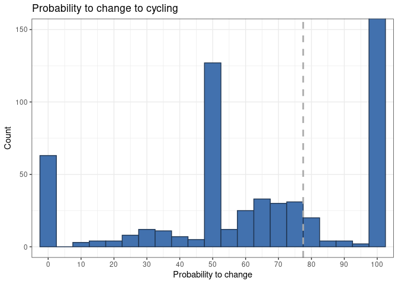<!-- -->

```r
#histograma simples, com a mediana assinalada em linha tracejada, e números com separador de milhar
summary(TODOS$lenght)
```

```
##    Min. 1st Qu.  Median    Mean 3rd Qu.    Max.    NA's 
##       0    3018    5922    8539   10703   62056     117
```

```r
ggplot(TODOS[TODOS$lenght<=12000 & !is.na(TODOS$lenght),], aes(x=lenght)) +
  geom_histogram(binwidth=500,color="#1F3552", fill="#79C000")+ 
  geom_vline(xintercept = 5922, size = 1, colour = "blue", linetype = "dashed") +
  scale_x_continuous(breaks = seq(0, 12000, 1000),labels=function(y) format(y, big.mark = " ")) +
  labs(title="Distancia das viagens") +  labs(x="Distância [m]", y="Casos") + theme_bw()
```

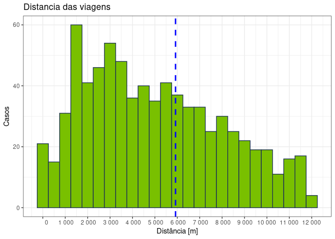<!-- -->

##Gáficos de tarte ou waffles  

```r
#pie chart 
TODOS$Gender<-factor(TODOS$Gender)
levels(TODOS$Gender)<- c("Male", "Female", "Other")
pie(table(TODOS$Gender))
```

<!-- -->


```r
library(waffle)
#waffle
vals <- c(313/1196*100,766/1196*100,113/1196*100)
val_names <- sprintf("%s (%s)", c("Cyclists", "Non-Cyclists", "Quitters"), scales::percent(round(vals/sum(vals), 3)))
names(vals) <- val_names
waffle::waffle(vals, rows = 5,  title = "Types of cyclists") 
```

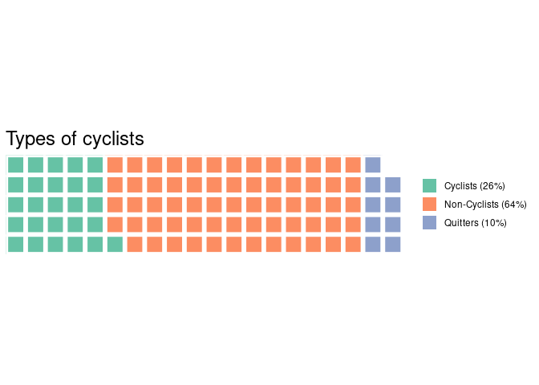<!-- -->

```r
## dois waffle num só plot
iron(
  waffle(vals, rows = 5,  title = "Types of cyclists"),
  waffle(c(Male = 610/1196*100, Female = 583/1196*100, Other=3/1196*100), rows = 5, colors = c("#702963", "#FFA500","#003153"), title = "Gender")
)
```

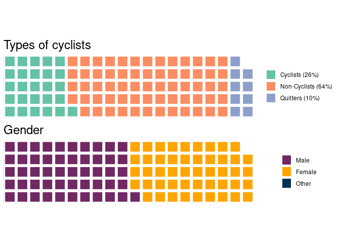<!-- -->

##Gráficos de barras 

###Barras verticais

```r
#vertical, legendas a 45º, por categoria - MESSY
ggplot(data=MCTRIGGERS, aes(x=reorder(names,-MCTRIGGERS.MEAN), y=MCTRIGGERS.MEAN, fill = Category)) +
  geom_bar(stat="identity") +geom_text(aes(label=ENshort), size=5, hjust = -0.05, angle =45, vjust=-0.3)  +
  labs(title = "Triggers for cycling - relevance", x = "Triggers of Cyclists", y = "Mean of weighted scores") +
  theme_classic() +theme(axis.text.x=element_blank(),axis.ticks.x=element_blank(), legend.position=c(0.8,0.8)) +
  scale_fill_brewer(palette="Paired") +  coord_cartesian(xlim=c(0,39)) + ylim(NA, 0.16)
```

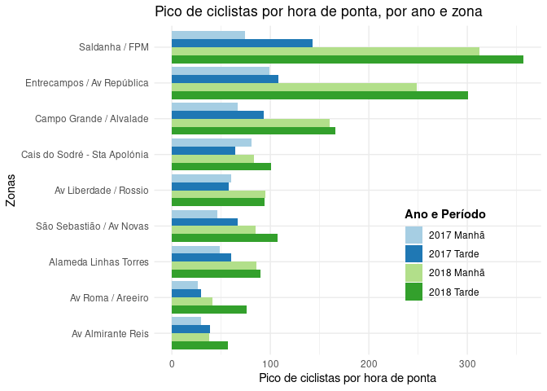<!-- -->

```r
#barras com realce dos quartis nas legendas
ggplot(data=MCTRIGGERS, aes(x=reorder(names,-MCTRIGGERS.MEAN), y=MCTRIGGERS.MEAN, fill = quartis)) +
  geom_bar(stat="identity") +geom_text(aes(label=ENshort), data=subset(MCTRIGGERS,quartis=="75-100%"), size=4, hjust = -0.05, angle =45, vjust=-0.3) +
  geom_text(aes(label=ENshort), data=subset(MCTRIGGERS,quartis=="50-75%"), size=3, hjust = -0.05, angle =45, vjust=-0.3, color="azure4") +
  geom_text(aes(label=ENshort), data=subset(MCTRIGGERS,names=="17"), size=3, hjust = -0.05, angle =45, vjust=-0.3) +
  labs(title = "Triggers for cycling - relevance", x = "Triggers of Cyclists", y = "Mean of weighted scores") +
  theme_classic() +theme(axis.text.x=element_blank(),axis.ticks.x=element_blank(), legend.position=c(0.8,0.8), plot.title = element_text(size=22, hjust=0.5)) +
  scale_fill_manual(values = wes_palette("GrandBudapest1"), "Frequency of choices")  + coord_cartesian(xlim=c(0,45)) + ylim(NA, 0.14)
```

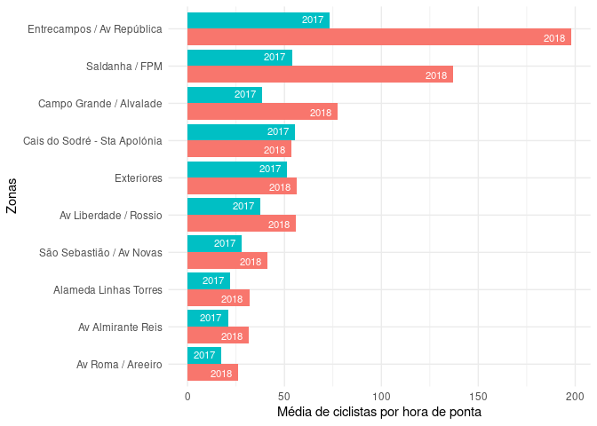<!-- -->

####Stacked 100%  

```r
#barras de 100% stacked
ggplot(TODOS, aes(CHANGE_Class3, fill=Gender) ) +  geom_bar(position="Fill")+ scale_fill_grey()+ theme_classic()+ 
  labs(title="Gender", 
       subtitle="Sub-groups of potential cyclists",
       x="Class",
       y=element_blank())+scale_y_continuous(labels = scales::percent)
```

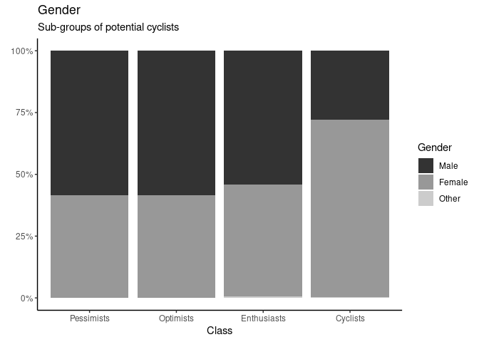<!-- -->

```r
#com palete de cores, e com Cyclists primeiro
ggplot(TODOS, aes(factor(TODOS$CHANGE_Class3, levels=rev(levels(TODOS$CHANGE_Class3))), fill=Gender) ) +  geom_bar(position="Fill")+ scale_fill_brewer( palette = "Pastel2")+ theme_classic()+
  labs(title="Gender", 
       subtitle="Sub-groups of potential cyclists",
       x="Class",
       y=element_blank())+scale_y_continuous(labels = scales::percent) 
```

<!-- -->

```r
#remover os que não repsonderam pq não tinham carro
ggplot(TODOS[!is.na(TODOS$CarGiveUp),], aes(CHANGE_Class3, fill=CarGiveUp) ) +  geom_bar(position="fill")+ scale_fill_brewer( palette ="RdYlGn") + theme_classic() +
  theme(legend.title=element_blank()) +
  labs(title="Could you give up having a car?", 
       subtitle="Sub-groups of potential cyclists",
       x="Class",
       y=element_blank())+scale_y_continuous(labels = scales::percent)
```

<!-- -->

```r
#alterar ordem das cores
ggplot(TODOS[TODOS$MODES!="Other",], aes(CHANGE_Class3, fill=MODES) ) +  geom_bar(position="fill")+
  scale_fill_brewer( palette = "Paired", direction=-1)+ theme_classic() + theme(legend.title=element_blank())+
  labs(title="Travel Mode", 
       subtitle="Sub-groups of potential cyclists",
       x="Class", y=element_blank())+scale_y_continuous(labels = scales::percent)
```

<!-- -->


```r
#meter valores de percentagem nas barras
library(JLutils)#para usar o stat_fill_labels, ver script acima
ggplot(TODOS[TODOS$MODES!="Other",], aes(CHANGE_Class3, fill=MODES) ) +  geom_bar(position = "fill")+
  stat_fill_labels(size = 3)+
  scale_fill_brewer( palette = "Paired", direction=-1)+ theme(legend.title=element_blank())+
  labs(title="Travel Mode", 
       subtitle="Sub-groups of potential cyclists",
       x="Class", y=element_blank())+scale_y_continuous(labels = scales::percent)

#plotar e gravar
ggplot(data=subset(TComb2,(Freq>2 & Freq<100)), aes(x=reorder(Var1,Freq), y=Freq))+geom_bar(stat="identity")+coord_flip()+
  geom_text(aes(label=Freq),size=3,hjust=-0.5)+
  labs(title="Travel Mode alternative combinations", subtitle="Freq >2",x="Combinations")
ggsave("TMode_Alternative_freq.png", width = 8.5, height = 11, dpi=300)
```

###Barras horizontais 

```r
#barras na horixontal
ggplot(CONTAGENSzonasMT, aes(x=reorder(Names,SumFluxos), y=SumFluxos, fill=factor(AnoMT, levels=c("2018 Tarde", "2018 Manhã","2017 Tarde", "2017 Manhã")))) +
  geom_bar(stat="identity", position="dodge") + guides(fill=guide_legend(reverse=TRUE), colour=guide_legend(reverse=TRUE)) +
  scale_fill_brewer(palette="Paired", direction=-1, "Ano e Período") + ggtitle("Pico de ciclistas por hora de ponta, por ano e zona") +
  coord_flip() + theme_minimal() + theme(legend.position = c(0.752, 0.305), legend.title = element_text(face="bold")) + labs(y="Pico de ciclistas por hora de ponta", x="Zonas")
```

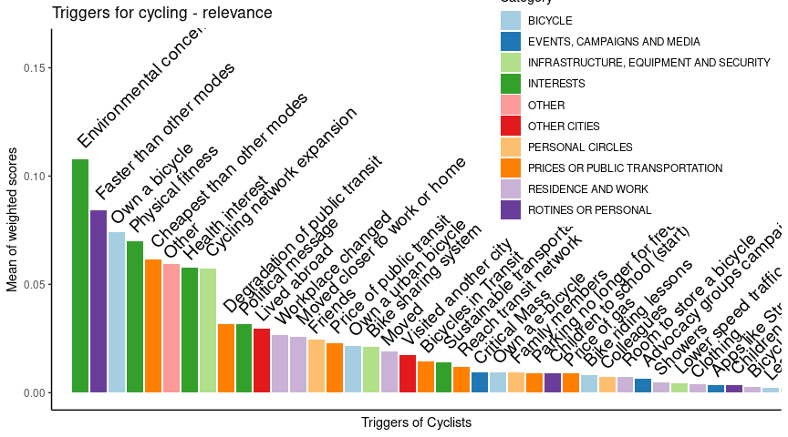<!-- -->

```r
#simplificado, com legendas nas barras
ggplot(CONTAGENSzonas, aes(x=reorder(Names,SumFluxos), y=SumFluxos4, fill=factor(Ano, levels=c("2018","2017")))) +
  geom_bar(stat="identity", position="dodge", show.legend=F) + #scale_fill_manual(values = wes_palette("Darjeeling1"), 2) +
  geom_text(aes(label=Ano), color="white", size=3, position = position_dodge(1), hjust=1.3) +
  coord_flip() + theme_minimal() + labs(y="Média de ciclistas por hora de ponta", x="Zonas")
```

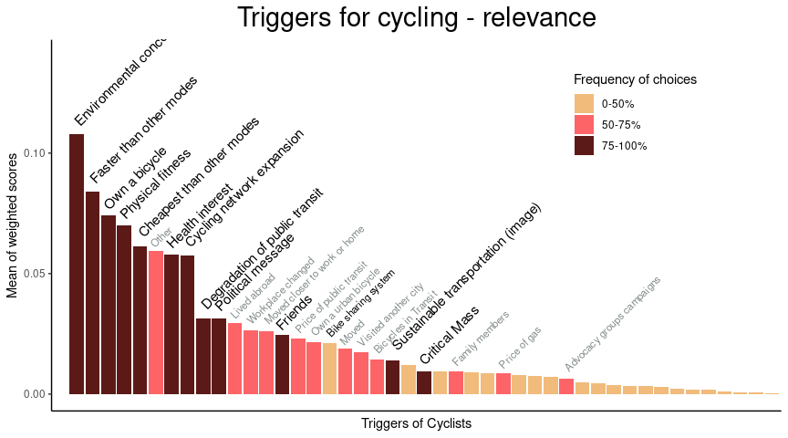<!-- -->

###Facets

```r
#meter vários gráficos lado a lado, pela variável "ERA" - isto funciona bem com um Melt primeiro
ggplot(data=subset(MCBARRIERSERA.JOINALL,(MCBARRIERSERA.MEANscale>10 & names!="Other") & (MCBARRIERSERA.MEANscale>4.5 & names!="40")), aes(x=reorder(ENshort,MCBARRIERSERA.MEANscale), y=ERA_MEANscale, fill = quartis)) +
  geom_bar(stat="identity")+
  labs(title = "Previous Barriers for cycling - relevance", x = "Barriers of Cyclists", y = "Mean of weighted scores") +
  theme(axis.text.x=element_text(size=5), plot.title = element_text(size=22, hjust=0.5)) +
  scale_fill_manual(values = wes_palette("GrandBudapest1"), "Frequency of choices") + 
  coord_flip() + facet_wrap(~ERA)
```

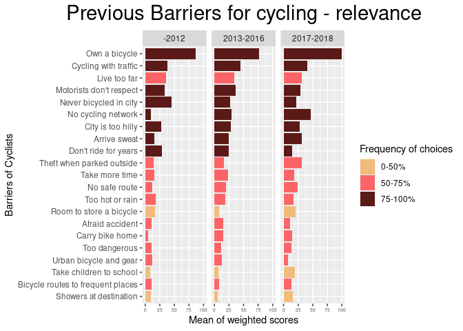<!-- -->

```r
#na vertical, sem linhas horizontais, por arruamento
ggplot(CONTAGENSevolucao, aes(x=Ano, y=Ciclistas, fill=factor(Gira, levels=c("Trotinetas","Bicicleta partilhada", "Bicicleta própria")))) +
  geom_bar(stat="identity", position="stack") + facet_grid(~Local2, switch="x") + scale_fill_manual(values=c("#D4A017", "#B2DF8A", "#33A02C")) +
  guides(fill=guide_legend(reverse=TRUE), colour=guide_legend(reverse=TRUE)) +  theme_bw() + ggtitle("Comparação do volume de ciclistas observados por local") +
  theme(legend.position = c(0.9,0.8), legend.title=element_blank(),panel.grid.major.x=element_blank(),axis.ticks.y=element_blank(),  axis.text.y=element_blank(), panel.border=element_blank(), strip.placement="outside", strip.background = element_rect(colour = "white")) +
  labs(y="Volume de ciclistas", x= element_blank())
```

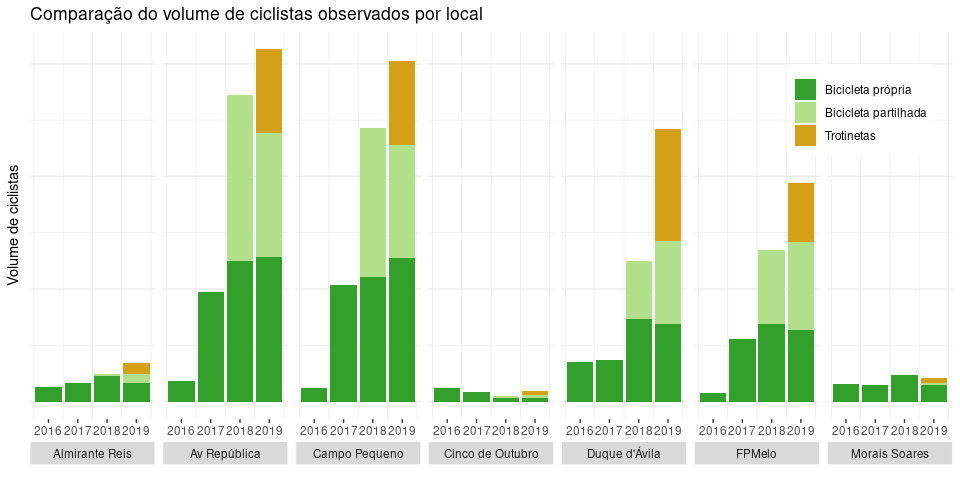<!-- -->

```r
# ! não está a funcionar bem a parte de remover os eixos
#é capaz de haver uma maneira mais eficiente de fazer isto...
```

Table: Exemplo dos dados em melt

Local           Gira                     Ano   Ciclistas   VolumeGIRA   Trotinetas
--------------  ---------------------  -----  ----------  -----------  -----------
Campo Pequeno   Bicicleta própria       2018         221          265            0
Campo Pequeno   Bicicleta partilhada    2018         265            0            0
Campo Pequeno   Bicicleta própria       2019         255          201          149
Campo Pequeno   Bicicleta partilhada    2019         201            0            0
Campo Pequeno   Trotinetas              2019         149            0            0
Campo Pequeno   Bicicleta partilhada    2016           0            0            0
Campo Pequeno   Bicicleta partilhada    2017           0            0            0
Campo Pequeno   Trotinetas              2016           0            0            0

  
##Gráficos de bolas  
Plot cujas bolas variam com o número de casos

```r
#primeiro fazer uma tabela de frequências por categoria, depois fazer o plot
DF_summary = ddply(
  SubClustNC,
  .(B3types, CHANGE_Class3),
  summarize,
  count=length(CHANGE_Class3))
ggplot(DF_summary, aes(B3types, CHANGE_Class3)) +
  geom_point(aes(size=count)) + scale_size(range = c(1, 30))   + theme(legend.position="none") +
  labs(title = "Types of potential cyclists", x = "Stages of Change", y = "Change class")
```

<!-- -->
Alterar cores e adicionar labels nas bolas  

```r
##criar coluna com a cor
DF_summary$prob <- c("g","y","y","g","g","y","r","g","g") #green, yellow, red 
ggplot(DF_summary, aes(B3types, CHANGE_Class3)) +
  geom_point(aes(size=count, colour=factor(prob)))+scale_color_manual(values = c("#00BA38", "#F8766D","#619CFF")) +
  geom_text(data=DF_summary[DF_summary$count>25,],aes(label = count), size=4) +
  geom_text(data=DF_summary[DF_summary$count<25,],aes(label = count), hjust=-1,vjust=-1, size=4) + #para as bolas pequenas
  scale_size(range = c(1, 30))   + theme(legend.position="none") +
  labs(title = "Types of potential cyclists", x = "Stages of Change", y = "Change class")
```

<!-- -->

  
##Gráficos de dispersão, com indicação da linha de tendência

```r
#logarítmica
ggplot(subset(NCspss,NCspss$lenght>0 & NCspss$PercCiclovia>0), aes(lenght,PercCiclovia), geom = "point")+
  geom_point()+geom_smooth(method = "lm", formula = y~log(x))+theme_classic()
```

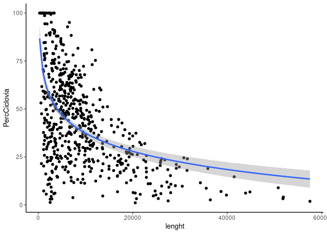<!-- -->

```r
#exponencial
ggplot(subset(NCspss,NCspss$lenght>0 & NCspss$PercCiclovia>0), aes(lenght,PercCiclovia), geom = "point")+
  geom_point()+geom_smooth(method = "lm", formula = (y~exp(x)),se=FALSE)+theme_classic()
```

```r
#quadrática
#If we attempted to estimate a regression model using x+x^2, R would drop the x^2 term because it thinks it is a duplicate of x. We use the I() “as-is” operator
ggplot(subset(NCspss,NCspss$lenght>0 & NCspss$PercCiclovia>0), aes(lenght,PercCiclovia), geom = "point")+
  geom_point()+geom_smooth(method = "lm", formula = (y~x+I(x^2)),se=FALSE)+theme_classic()
```

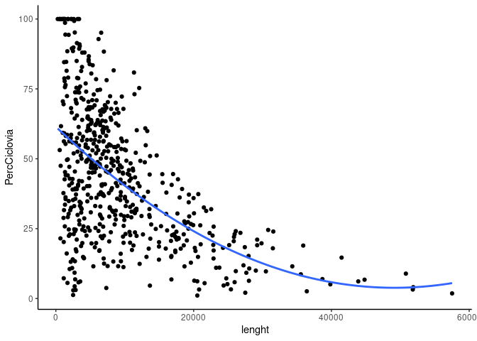<!-- -->

```r
#invertido
ggplot(subset(NCspss,NCspss$lenght>0), aes(PercCiclovia,lenght), geom = "point") +
  geom_point()+geom_smooth(method = "loess", formula = y~x, se=F) +
  xlab("Potential percentage of commuting trip in cycling infrastructure") +ylab("Commuting distance [m]") +
  coord_cartesian(xlim = c(0, 100), ylim = c(0, 40000))+ theme_bw()
```

<!-- -->

```r
#Com cores diferentes, graduadas por determinada variável
ggplot(NCspss, aes(lenght,PercCiclovia, color=CHANGE), geom = "point")+geom_point()+ 
  scale_color_gradient(low="red", high="black", name="Propensity to cycling") +
  ylab("Potential percentage of commuting trip in cycling infrastructure") +
  xlab("Commuting distance [m]") +
  coord_cartesian(xlim = c(0, 40000), ylim = c(0, 100)) +
  theme_bw() + theme(legend.position=c(0.8,0.7))
```

<!-- -->


##Gráficos de violinos

```r
ggplot(TODOS, aes(CHANGE_Class3, Age)) +
  geom_violin(fill="black") + 
  labs(title="Age", 
       subtitle="Sub-groups of potential cyclists",
       x="Class",
       y="Age")
```

<!-- -->

##Gráficos de likert scale
tutorial [aqui](http://rnotr.com/likert/ggplot/barometer/likert-plots/)  
Ver passo a passo
<p>
<button class="btn btn-primary collapsed" data-toggle="collapse" data-target="#ce1">
</button>
</p>
<div class="collapse" id="ce1">
<div class="card card-body">

```r
#0 - preparar os dados
#Strongly dislike (2),	Dislike (3),	I am indifferent (4),	Like (5),	Strongly like (6),	I never tried (1)

#Organizar dados para ter uma tabela com modo e pecentagem de cada nivel
Walk <-table(GOSTOS$TExperience_Walk)
Car <-table(GOSTOS$TExperience_Car)
Bus <-table(GOSTOS$TExperience_Bus)
Subway <-table(GOSTOS$TExperience_Subway)
Motorcycle <-table(GOSTOS$TExperience_Moto)
Tram <-table(GOSTOS$TExperience_Tram)
Train <-table(GOSTOS$TExperience_Train)
Bike <-table(GOSTOS$TExperience_Bike)
Taxi <-table(GOSTOS$Texperience_Taxi)
Ferry <-table(GOSTOS$TExperience_Ferry)

TREXPER <-rbind(Walk,Car,Bus,Subway,Motorcycle,Tram,Train,Bike,Taxi,Ferry)
TREXPER <-data.frame(TREXPER)
TREXPER$Mode <-rownames(TREXPER)

rm(Walk,Car,Bus,Subway,Motorcycle,Tram,Train,Bike,Taxi,Ferry)
TREXPER$Soma <- rowSums(TREXPER[,c(1:5)])

TREXPERperc <- TREXPER[,c(1:5)]/TREXPER$Soma
TREXPERperc$Mode <-TREXPER$Mode
TRExperience <- TREXPERperc[,c(6,1:5)]
colnames(TRExperience) <- c("Mode", "Strongly dislike",	"Dislike",	"Indifferent",	"Like",	"Strongly like")


#1
tab<-TRExperience
mytitle<-"How do you assess the travel experience \nof the following modes of transportation?"
mylevels<-c("Strongly dislike",	"Dislike",	"Indifferent",	"Like",	"Strongly like")


#2 - divide "Indiferent" this estimate by two, and then include it twice.
numlevels<-length(tab[1,])-1
numcenter<-ceiling(numlevels/2)+1
tab$midvalues<-tab[,numcenter]/2
tab2<-cbind(tab[,1],tab[,2:ceiling(numlevels/2)],
            tab$midvalues,tab$midvalues,tab[,numcenter:numlevels+1])
colnames(tab2)<-c("outcome",mylevels[1:floor(numlevels/2)],"midlow",
                  "midhigh",mylevels[numcenter:numlevels])


#3 ajuste nos limites do gráfico, mas pode-se fazer à mão no fim
numlevels<-length(mylevels)+1
point1<-2
point2<-((numlevels)/2)+1
point3<-point2+1
point4<-numlevels+1
mymin<-(ceiling(max(rowSums(tab2[,point1:point2]))*4)/4)*-100
mymax<-(ceiling(max(rowSums(tab2[,point3:point4]))*4)/4)*100


#4 trabalhar nas cores
numlevels<-length(tab[1,])-1
temp.rows<-length(tab2[,1])
pal<-brewer.pal((numlevels-1),"RdBu")
pal[ceiling(numlevels/2)]<-"#DFDFDF"
legend.pal<-pal
pal<-c(pal[1:(ceiling(numlevels/2)-1)], pal[ceiling(numlevels/2)], 
       pal[ceiling(numlevels/2)], pal[(ceiling(numlevels/2)+1):(numlevels-1)])


#5 meter valores em percentagem e ordenar as categorias
tab3<-melt(tab2,id="outcome")
tab3$col<-rep(pal,each=temp.rows)
tab3$value<-tab3$value*100
tab3$outcome<-str_wrap(tab3$outcome, width = 40)
tab3$outcome<-factor(tab3$outcome, levels = tab2$outcome[order(-(tab2[,5]+tab2[,6]+tab2[,7]))])
highs<-na.omit(tab3[(length(tab3[,1])/2)+1:length(tab3[,1]),])
lows<-na.omit(tab3[1:(length(tab3[,1])/2),])
lows <- lows[rev(rownames(lows)),]
lows$col <- factor(lows$col, levels = c("#CA0020","#F4A582", "#DFDFDF"))


#6 plot
ggplot() + geom_bar(data=highs, aes(x = outcome, y=value, fill=col), position="stack", stat="identity") +
  geom_bar(data=lows, aes(x = outcome, y=-value, fill=col), position="stack", stat="identity") +
  geom_hline(yintercept = 0, color =c("white")) +
  scale_fill_identity("",labels = mylevels, breaks=legend.pal, guide="legend") + 
  theme_fivethirtyeight() + 
  coord_flip() +
  labs(title=mytitle, y="Percent",x="") +
  theme(plot.title = element_text(size=14, hjust=0.5)) +
  theme(axis.text.y = element_text(hjust=0)) +
  theme(legend.position = "bottom") +
  theme(rect=element_rect(fill ="White", linetype = 0, colour = NA)) +
  theme(axis.title = element_text(size=8,hjust=1)) +
  scale_y_continuous(breaks=seq(mymin,mymax,25), limits=c(-62,mymax)) #substituí mymin por -62 para cortar um pouco à esquerda


####POR GRUPO####
library(likert)
#criar tabela reduzida
SELFY<- SubNC[,c(170:176,242)]

SELFY$SelfEfficacy_1<-factor(SELFY$SelfEfficacy_1, labels = c("No","I am not sure","Yes"))
SELFY$SelfEfficacy_2<-factor(SELFY$SelfEfficacy_2, labels = c("No","I am not sure","Yes"))
SELFY$SelfEfficacy_3<-factor(SELFY$SelfEfficacy_3, labels = c("No","I am not sure","Yes"))
SELFY$SelfEfficacy_4<-factor(SELFY$SelfEfficacy_4, labels = c("No","I am not sure","Yes"))
SELFY$SelfEfficacy_5<-factor(SELFY$SelfEfficacy_5, labels = c("No","I am not sure","Yes"))
SELFY$SelfEfficacy_6<-factor(SELFY$SelfEfficacy_6, labels = c("No","I am not sure","Yes"))
SELFY$SelfEfficacy_7<-factor(SELFY$SelfEfficacy_7, labels = c("No","I am not sure","Yes"))

names(SELFY)[c(1:7)]<- c("Riding with the traffic", "Fixing a flat tire", "Maneuver an obstacle", "Climbing a steep street", "Traversing a bad terrain", "Planning a bicycle route", "Riding a bike with rain") #MÁX 24 chr

#por grupos
ResultySelfG<- likert(SELFY[c(1:7)], grouping=SELFY$CHANGE_Class)
ResultySelfGs <- likert(summary = ResultySelfG$results, grouping = ResultySelfG$results[,1])
plot(ResultySelfGs, type="bar")
plot(ResultySelfGs, type="bar", centered=FALSE)
```

</div>
</div>
Exemplo com 5 levels  
<!-- -->


Outro estilo, mas com 3 levels
  Em facets no fim  
<p>
<button class="btn btn-primary collapsed" data-toggle="collapse" data-target="#ce2">
</button>
</p>
<div class="collapse" id="ce2">
<div class="card card-body">

```r
##Likerts
library(likert)
Personalityyy$Optimist<-factor(Personalityyy$Optimist, labels = c("Not at all", "Somewhat", "Yes, that's me"))
Personalityyy$Adventurous<-factor(Personalityyy$Adventurous, labels = c("Not at all", "Somewhat", "Yes, that's me"))
Personalityyy$Routines<-factor(Personalityyy$Routines, labels = c("Not at all", "Somewhat", "Yes, that's me"))
Personalityyy$Spontaneous<-factor(Personalityyy$Spontaneous, labels = c("Not at all", "Somewhat", "Yes, that's me"))
Personalityyy$Outdoors<-factor(Personalityyy$Outdoors, labels = c("Not at all", "Somewhat", "Yes, that's me"))
Personalityyy$RiskTaker<-factor(Personalityyy$RiskTaker, labels = c("Not at all", "Somewhat", "Yes, that's me"))
Personalityyy$CloseHome<-factor(Personalityyy$CloseHome, labels = c("Not at all", "Somewhat", "Yes, that's me"))
Personalityyy$Efficient<-factor(Personalityyy$Efficient, labels = c("Not at all", "Somewhat", "Yes, that's me"))
Personalityyy$Variety<-factor(Personalityyy$Variety, labels = c("Not at all", "Somewhat", "Yes, that's me"))
Personalityyy$OnTime<-factor(Personalityyy$OnTime, labels = c("Not at all", "Somewhat", "Yes, that's me"))
Personalityyy$Alone<-factor(Personalityyy$Alone, labels = c("Not at all", "Somewhat", "Yes, that's me"))
Personalityyy$Independent<-factor(Personalityyy$Independent, labels = c("Not at all", "Somewhat", "Yes, that's me"))
Personalityyy$Creative<-factor(Personalityyy$Creative, labels = c("Not at all", "Somewhat", "Yes, that's me"))
Personalityyy$Patient<-factor(Personalityyy$Patient, labels = c("Not at all", "Somewhat", "Yes, that's me"))
Personalityyy$Restless<-factor(Personalityyy$Restless, labels = c("Not at all", "Somewhat", "Yes, that's me"))
Personalityyy$Leader<-factor(Personalityyy$Leader, labels = c("Not at all", "Somewhat", "Yes, that's me"))
Personalityyy$Participative<-factor(Personalityyy$Participative, labels = c("Not at all", "Somewhat", "Yes, that's me"))
Personalityyy$Lazy<-factor(Personalityyy$Lazy, labels = c("Not at all", "Somewhat", "Yes, that's me"))
Personalityyy$CHANGE_Class<-factor(Personalityyy$CHANGE_Class, labels = c("Irreducible", "Pessimists", "Optimists","Enthusiasts"))

Personalityyy0<-Personalityyy[Personalityyy$CHANGE_Class3=="Pessimists",c(1:18)]
Personalityyy1<-Personalityyy[Personalityyy$CHANGE_Class3=="Optimists",c(1:18)]
Personalityyy2<-Personalityyy[Personalityyy$CHANGE_Class3=="Enthusiasts",c(1:18)]
Personalityyy3<-Personalityyy[Personalityyy$CHANGE_Class3=="Cyclists",c(1:18)]

Resultyy0 = likert(Personalityyy0)
Resultyy1 = likert(Personalityyy1)
Resultyy2 = likert(Personalityyy2)
Resultyy3 = likert(Personalityyy3)
Gp0<-plot(Resultyy0, type="bar",centered=F)+ggtitle("Pessimists")
Gp1<-plot(Resultyy1, type="bar",centered=F)+ggtitle("Optimists")
Gp2<-plot(Resultyy2, type="bar",centered=F)+ggtitle("Enthusiasts")
Gp3<-plot(Resultyy3, type="bar",centered=F)+ggtitle("Cyclists")
grid.arrange(Gp0, Gp1, Gp2, Gp3,  ncol = 2)


#por grupos
ResultyG<- likert(Personalityyy[c(1:18)], grouping=Personalityyy$CHANGE_Class3)
ResultyGs <- likert(summary = ResultyG$results, grouping = ResultyG$results[,1])
plot(ResultyGs, type="bar")
#separar lado a lado
ResultyG_1 <- likert(Personalityyy[c(1:6)], grouping=Personalityyy$CHANGE_Class3)
ResultyGs_1 <- likert(summary = ResultyG_1$results, grouping = ResultyG_1$results[,1])
ResultyG_2 <- likert(Personalityyy[c(7:12)], grouping=Personalityyy$CHANGE_Class3)
ResultyGs_2 <- likert(summary = ResultyG_2$results, grouping = ResultyG_2$results[,1])
ResultyG_3 <- likert(Personalityyy[c(13:18)], grouping=Personalityyy$CHANGE_Class3)
ResultyGs_3 <- likert(summary = ResultyG_3$results, grouping = ResultyG_3$results[,1])
GPersy1<-plot(ResultyGs_1, type="bar", centered=FALSE)
GPersy2<-plot(ResultyGs_2, type="bar", centered=FALSE)
GPersy3<-plot(ResultyGs_3, type="bar", centered=FALSE)

library(gridExtra)
grid.arrange(GPersy1, GPersy2, GPersy3,  ncol = 3)
```

</div>
</div>
Exemplos  

```r
library(likert)
Resultyy3 = likert(Personalityyy3)
plot(Resultyy3, type="bar",centered=F)+ggtitle("Cyclists")
```

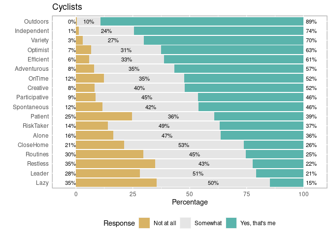<!-- -->

```r
ResultyG_1 <- likert(Personalityyy[c(1:6)], grouping=Personalityyy$CHANGE_Class3)
ResultyGs_1 <- likert(summary = ResultyG_1$results, grouping = ResultyG_1$results[,1])
plot(ResultyGs_1, type="bar", centered=FALSE)
```

<!-- -->


#Modelação
##Tabelas resumo dos dados  

```r
#só para contínuas, estilo latex
library(stargazer)
stargazer::stargazer(TODOS[,c(3,15:17)], type = "text", title = "Descriptive statistics", digits=1) #mudar o type para text, latex ou htm
```

```
## 
## Descriptive statistics
## ==================================================================
## Statistic      N    Mean   St. Dev. Min Pctl(25) Pctl(75)   Max   
## ------------------------------------------------------------------
## Age          1,079  39.6     11.0   16     31       46       83   
## lenght        962  8,539.0 8,446.6  0.0 3,018.3  10,703.2 62,056.5
## DistCiclov    962  2,355.4 2,009.5  0.0  587.7   3,663.2  9,171.0 
## PercCiclovia  962   34.5     27.2   0.0   11.1     53.8    100.0  
## ------------------------------------------------------------------
```


```r
#tabela com a descrição das variáveis contínuas e categóricas!
library(summarytools) #para todo o tipo, gera um html
DescStat<-dfSummary(TODOS[,c(3,4,8,15)])
view(DescStat) #abrir o botão do view pane para o browser, guardar como html
```
<style type="text/css">
 img {   background-color: transparent;   border: 0; }  .st-table td, .st-table th {   padding: 8px; }  .st-table > thead > tr {    background-color: #eeeeee; }  .st-cross-table td {   text-align: center; }  .st-descr-table td {   text-align: right; }  .st-small {   font-size: 13px; }  .st-small td, .st-small th {   padding: 8px; }  table.st-table th {   text-align: center; }  .st-small > thead > tr > th, .st-small > tbody > tr > th, .st-small > tfoot > tr > th, .st-small > thead > tr > td, .st-small > tbody > tr > td, .st-small > tfoot > tr > td {   padding-left: 12px;   padding-right: 12px; }  table.st-table > thead > tr {    background-color: #eeeeee; }   table.st-table td span {   display: block; }  .st-container {   width: 100%;   padding-right: 15px;   padding-left: 15px;   margin-right: auto;   margin-left: auto;   margin-top: 15px; }  .st-multiline {   white-space: pre; }  .st-table {     width: auto;     table-layout: auto;     margin-top: 20px;     margin-bottom: 20px;     max-width: 100%;     background-color: transparent;     border-collapse: collapse; }   .st-table > thead > tr > th, .st-table > tbody > tr > th, .st-table > tfoot > tr > th, .st-table > thead > tr > td, .st-table > tbody > tr > td, .st-table > tfoot > tr > td {   vertical-align: middle; }  .st-table-bordered {   border: 1px solid #bbbbbb; }  .st-table-bordered > thead > tr > th, .st-table-bordered > tbody > tr > th, .st-table-bordered > tfoot > tr > th, .st-table-bordered > thead > tr > td, .st-table-bordered > tbody > tr > td, .st-table-bordered > tfoot > tr > td {   border: 1px solid #cccccc; }  .st-table-bordered > thead > tr > th, .st-table-bordered > thead > tr > td, .st-table thead > tr > th {   border-bottom: none; }  .st-freq-table > thead > tr > th, .st-freq-table > tbody > tr > th, .st-freq-table > tfoot > tr > th, .st-freq-table > thead > tr > td, .st-freq-table > tbody > tr > td, .st-freq-table > tfoot > tr > td, .st-freq-table-nomiss > thead > tr > th, .st-freq-table-nomiss > tbody > tr > th, .st-freq-table-nomiss > tfoot > tr > th, .st-freq-table-nomiss > thead > tr > td, .st-freq-table-nomiss > tbody > tr > td, .st-freq-table-nomiss > tfoot > tr > td, .st-cross-table > thead > tr > th, .st-cross-table > tbody > tr > th, .st-cross-table > tfoot > tr > th, .st-cross-table > thead > tr > td, .st-cross-table > tbody > tr > td, .st-cross-table > tfoot > tr > td {   padding-left: 20px;   padding-right: 20px; }     .st-table-bordered > thead > tr > th, .st-table-bordered > tbody > tr > th, .st-table-bordered > thead > tr > td, .st-table-bordered > tbody > tr > td {   border: 1px solid #cccccc; }  .st-table-striped > tbody > tr:nth-of-type(odd) {   background-color: #ffffff; }  .st-table-striped > tbody > tr:nth-of-type(even) {   background-color: #f9f9f9; }   .st-descr-table > thead > tr > th, .st-descr-table > tbody > tr > th, .st-descr-table > tfoot > tr > th, .st-descr-table > thead > tr > td, .st-descr-table > tbody > tr > td, .st-descr-table > tfoot > tr > td {   padding-left: 24px;   padding-right: 24px;   word-wrap: break-word; }  .st-freq-table, .st-freq-table-nomiss, .st-cross-table {   border: medium none; }  .st-freq-table > thead > tr:nth-child(1) > th:nth-child(1), .st-cross-table > thead > tr:nth-child(1) > th:nth-child(1), .st-cross-table > thead > tr:nth-child(1) > th:nth-child(3) {   border: none;   background-color: #ffffff;   text-align: center; }  .st-protect-top-border {   border-top: 1px solid #cccccc !important; }  .st-ws-char {   display: inline;   color: #999999;   letter-spacing: 0.2em; } </style>
<!--html_preserve--><div class="container st-container">
<h3>Data Frame Summary</h3>
<strong>
TODOS
<br/>
</strong>
<strong>Dimensions</strong>: 1079 x 4
  <br/><strong>Duplicates</strong>: 37
<br/>
<table class="table table-striped table-bordered st-table st-table-striped st-table-bordered st-multiline ">
  <thead>
    <tr>
      <th align="center" class="no st-protect-top-border"><strong>No</strong></th>
      <th align="center" class="variable st-protect-top-border"><strong>Variable</strong></th>
      <th align="center" class="stats.values st-protect-top-border"><strong>Stats / Values</strong></th>
      <th align="center" class="freqs.pct.valid st-protect-top-border"><strong>Freqs (% of Valid)</strong></th>
      <th align="center" class="graph st-protect-top-border"><strong>Graph</strong></th>
      <th align="center" class="valid st-protect-top-border"><strong>Valid</strong></th>
      <th align="center" class="missing st-protect-top-border"><strong>Missing</strong></th>
    </tr>
  </thead>
  <tbody>
    <tr>
      <td align="center">1</td>
      <td align="left">Age
[integer]</td>
      <td align="left">Mean (sd) : 39.6 (11)
min < med < max:
16 < 39 < 83
IQR (CV) : 15 (0.3)</td>
      <td align="left" style="vertical-align:middle">60 distinct values</td>
      <td align="left" style="vertical-align:middle;padding:0;background-color:transparent"></td>
      <td align="center">1079
(100%)</td>
      <td align="center">0
(0%)</td>
    </tr>
    <tr>
      <td align="center">2</td>
      <td align="left">Gender
[factor]</td>
      <td align="left">1. Male
2. Female
3. Other</td>
      <td align="left" style="padding:0;vertical-align:middle"><table style="border-collapse:collapse;border:none;margin:0"><tr style="background-color:transparent"><td style="padding:0 5px 0 7px;margin:0;border:0" align="right">519</td><td style="padding:0 2px 0 0;border:0;" align="left">(</td><td style="padding:0;border:0" align="right">48.1%</td><td style="padding:0 4px 0 2px;border:0" align="left">)</td></tr><tr style="background-color:transparent"><td style="padding:0 5px 0 7px;margin:0;border:0" align="right">557</td><td style="padding:0 2px 0 0;border:0;" align="left">(</td><td style="padding:0;border:0" align="right">51.6%</td><td style="padding:0 4px 0 2px;border:0" align="left">)</td></tr><tr style="background-color:transparent"><td style="padding:0 5px 0 7px;margin:0;border:0" align="right">3</td><td style="padding:0 2px 0 0;border:0;" align="left">(</td><td style="padding:0;border:0" align="right">0.3%</td><td style="padding:0 4px 0 2px;border:0" align="left">)</td></tr></table></td>
      <td align="left" style="vertical-align:middle;padding:0;background-color:transparent"></td>
      <td align="center">1079
(100%)</td>
      <td align="center">0
(0%)</td>
    </tr>
    <tr>
      <td align="center">3</td>
      <td align="left">Income
[ordered, factor]</td>
      <td align="left">1. Live with difficulties
2. Live with moderate ease
3. Live without difficulties</td>
      <td align="left" style="padding:0;vertical-align:middle"><table style="border-collapse:collapse;border:none;margin:0"><tr style="background-color:transparent"><td style="padding:0 5px 0 7px;margin:0;border:0" align="right">79</td><td style="padding:0 2px 0 0;border:0;" align="left">(</td><td style="padding:0;border:0" align="right">8.0%</td><td style="padding:0 4px 0 2px;border:0" align="left">)</td></tr><tr style="background-color:transparent"><td style="padding:0 5px 0 7px;margin:0;border:0" align="right">529</td><td style="padding:0 2px 0 0;border:0;" align="left">(</td><td style="padding:0;border:0" align="right">53.2%</td><td style="padding:0 4px 0 2px;border:0" align="left">)</td></tr><tr style="background-color:transparent"><td style="padding:0 5px 0 7px;margin:0;border:0" align="right">386</td><td style="padding:0 2px 0 0;border:0;" align="left">(</td><td style="padding:0;border:0" align="right">38.8%</td><td style="padding:0 4px 0 2px;border:0" align="left">)</td></tr></table></td>
      <td align="left" style="vertical-align:middle;padding:0;background-color:transparent"></td>
      <td align="center">994
(92.12%)</td>
      <td align="center">85
(7.88%)</td>
    </tr>
    <tr>
      <td align="center">4</td>
      <td align="left">lenght
[numeric]</td>
      <td align="left">Mean (sd) : 8539 (8446.6)
min < med < max:
0 < 5922.2 < 62056.5
IQR (CV) : 7684.9 (1)</td>
      <td align="left" style="vertical-align:middle">944 distinct values</td>
      <td align="left" style="vertical-align:middle;padding:0;background-color:transparent"></td>
      <td align="center">962
(89.16%)</td>
      <td align="center">117
(10.84%)</td>
    </tr>
  </tbody>
</table>
</div><!--/html_preserve-->


##Matrizes de correlação, em plots bonitos

```r
library(Hmisc)
library(corrplot)
library(ggcorrplot)

#spearman para não paramétricos e rank-based
res<-cor(PERSONALITY[c(1:18)], method = "spearman", use = "complete.obs")
round(res,2)
res2 <- rcorr(as.matrix(PERSONALITY[c(1:18)],method = "spearman", use = "complete.obs")) #agora com p-values
flattenCorrMatrix(res2$r, res2$P)

corrplot(res, type = "upper", order = "hclust", method = "square", tl.col = "black")
corrplot(res, type = "upper", order = "hclust", method = "color", tl.col = "black") #hierárquico, na ordenação
corrplot(res, type = "upper", order = "FPC", method = "color", tl.col = "black") #componentes principais, na ordenação

# Insignificant correlation are crossed 
corrplot(res, p.mat = res2$P, type = "upper", order = "FPC", method = "color",
         + sig.level = c(.001, .01, .05), pch.cex = .9,insig = "label_sig", pch.col = "white",
         + tl.col = "black")
corrplot(res, p.mat = res2$P, type = "upper", order = "FPC", method = "color", insig = "pch", pch.cex = .9,
         +tl.col = "black") #ESTE
corrplot(res, p.mat = res2$P, type = "upper", order = "FPC", method = "color", sig.level = .05,
         tl.col = "black")

col<- colorRampPalette(c("blue", "white", "red"))(20)
heatmap(x = res, col = col, symm = TRUE)
```


```r
res<-cor(PERSONALITY[c(1:18)], method = "spearman", use = "complete.obs")
#round(res,2)
res2 <- rcorr(as.matrix(PERSONALITY[c(1:18)],method = "spearman", use = "complete.obs")) #agora com p-values

corrplot(res, p.mat = res2$P, type = "upper", order = "FPC", method = "color",
         insig = "pch", pch.cex = .9,tl.col = "black")
```

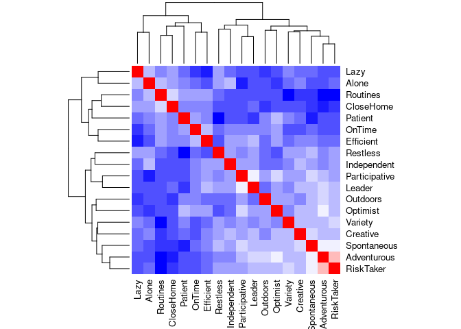<!-- -->

```r
col<- colorRampPalette(c("blue", "white", "red"))(20)
heatmap(x = res, col = col, symm = TRUE)
```

<!-- -->


##Modelo regressão linear
###Preparação das tabelas para Regressão Linear
Se houver variáveis categóricas, ele vai fixar uma delas (a primeira dos factores) e responder sobre a outra, ou outras classes

```r
#ordenar variáveis categóricas para referência
MODELSD$Gender<-as.numeric(MODELSD$Gender)
MODELSD$Gender<-factor(MODELSD$Gender)
levels(MODELSD$Gender)<-c("Other", "Female","Male")
MODELSD$Gender<-factor(MODELSD$Gender, levels=rev(levels(MODELSD$Gender))) #para tornar como referência o male
```
###Modelo LM

```r
Model00<-lm(formula = CANDNC.DISTb$TYPE ~ CANDNC.DISTb$Age)
summary(Model00)


#Várias variáveis
LRmodelGTodos<-lm(data= MODELSD[MODELSD$Gender!="Other",],formula = CHANGE ~
                Age +Gender + Income +PercCiclovia  + HBikeStorage_No +
               BConfidence + BExperience +Childhood_No)
summary(LRmodelGTodos)

#removendo os não sig ou expressivos
LRmodelG<-lm(data= MODELSD,formula = CHANGE ~
                    Age  + Income + BConfidence + BExperience)
summary(LRmodelG)

#starnartizar as variáveis (scale)
MODELSDst<-MODELSD[MODELSD$Gender!="Other",]
MODELSDst$Income<-as.numeric(MODELSDst$Income)

LRmodelGST<-lm(data= MODELSDst,formula = scale(CHANGE) ~
               scale(Age) + scale(Income)  + 
               VehiclesOwnHouse_Class + VehiclesCARSOwnHouse_Class+ 
               scale(BConfidence) + scale(BExperience))
summary(LRmodelGST)
AIC (LRmodelGST) 
```

##Modelo de escolha discreta - DCM
###Preparação das tabelas de escolha discreta DCM

```r
#meter a var dependente como categórica
DATAMZ$CHOICE<-factor(DATAMZ$CHOICE)
levels(DATAMZ$CHOICE)<-c("Car", "PTransit","Walk")
table(DATAMZ$CHOICE) #ver a proporção de escolhas

#Meter o município como categórico
DATAMZ$Municipality<-factor(DATAMZ$Municipality)
levels(DATAMZ$Municipality)<-c("Oeiras", "Cascais","Sintra")
table(DATAMZ$Municipality) #ver a proporção de Municipios

##Preparar a tabela expandida com os choice sets##
mldata <- mlogit.data(DATAMZ, choice="CHOICE", shape="wide")
#whether 'long' if each row is an alternative or 'wide' if each row is an observation

#Separar uma coluna em várias binárias
library(fastDummies)
dummy_columns() #Ver DV
#especificar diferenças para chr e num
dummy_cols()
```
>__Dica:__ Ver mais opções de preparação das tabelas para modelação [aqui](https://www.rdocumentation.org/packages/mlogit/versions/1.0-1/topics/mlogit.data)

###Modelo DCM

```r
#ir numerando para não nos perdermos. O zero é o com todas as variáveis incluídas
#O Carro é a variável de referência. o município 1 também
LRmodel_0<-mlogit(CHOICE ~ 1 | Municipality+Level+Rel+Age+Gen+Wrk+Stud+Inc+Car+Child+DISTANCE_W, data= mldata)#Com todas as variáveis
summary(LRmodel_0)

LRmodel_1<-mlogit(CHOICE ~ 1 | Age + Municipality + Car + DISTANCE_W, data= mldata)#Com apenas 3 variáveis
summary(LRmodel_1) #mau R2
```

##Modelos logit ordenados  
_Por completar_  

##Modelos logit binários
###Preparação das tabelas para logits

```r
#meter a var dependente como numérica - não pode ser categórica! e só pode ser 0 ou 1
DATA$CHOICE<-as.numeric(DATA$CHOICE)

#Se houver variáveis categóricas, ele vai fixar uma delas (a primeira dos factores) e responder sobre a outra, ou ouras classes

#ordenar variáveis categóricas para referência
MODELSD$Gender<-as.numeric(MODELSD$Gender)
MODELSD$Gender<-factor(MODELSD$Gender)
levels(MODELSD$Gender)<-c("Other", "Female","Male")
MODELSD$Gender<-factor(MODELSD$Gender, levels=rev(levels(MODELSD$Gender))) #para tornar como referência o male


#Meter zeros nos NA
DATA[is.na(DATA)]<-0
```

###Modelos logit binários
Ver @Field2009  
Ver também mais [aqui](https://stats.idre.ucla.edu/r/dae/logit-regression/)

```r
library(MASS)
library(mlogit)
#síntaxe
NOMEdoMODELO <- glm(formula = VAR_DEPENDENTE ~ Var1 + Var2 +... + Varf
                    , family = binomial, data = TABELA)


#1. logit com todas as variáveis
logit05_1 <- glm(data = MODEL05,CHANGE ~ .
                 , family = binomial)
summary(logit05_1)


#2. logit sugerido, com backward/forward stepwise method - vai descartando as variáveis com baixo AIC (ou incremendando)
logit05_2 <- stepAIC(logit05_1, direction = "backward")
summary(logit05_2)


#3. logit simplificado
logit05_2simples <- glm(formula = CHANGE ~ BikeOwn + BikeEOwn + LearnRide + BikeRoom + Clothes + 
                          Showers + Parking + BikeShare + Friends + GasRide + HealthNeed
                        , family = binomial, data = MODEL05)
summary(logit05_2simples)
```


###Odds-Ratio

```r
#Odds-ratio
exp(coef(logit05_2simples))

#1/OR
exp(cbind(OR = coef(logit05_2simples),"1/OR" =-coef(logit05_2simples), confint(logit05_2simples)))
```

###Efeitos marginais

```r
##Marginal effects
library(mfx)
logitmfx(formula = CHANGE ~  BikeEOwn + DistanceCloser + BikeRoom  + 
           SpeedLowerTraffic + PublicTransitBikes + Friends + HealthNeed
         , data = MODEL24) #logit24_2simples
```

##Modelos Hazard Based - Sobrevivência
Ver tutorial [aqui](https://www.emilyzabor.com/tutorials/survival_analysis_in_r_tutorial.html) e [aqui](http://www.sthda.com/english/wiki/survival-analysis-basics).  
_por completar_  

##Testes de goodness of fit  

###AIC

```r
AIC(LRmodelGST) 
```


###Anova
Para todas as variáveis independentes

```r
anova(logit05_2simples, test="Chisq")
```

###Log-Likelihood

```r
#Log-Likelihood
logLik(logit05_2simples)

#LLratio
library(lmtest)
lrtest(logit05_1,logit05_2simples) #vs restrito (intercept only)
lrtest(logit05_2simples) #vs null

#F test - compare two variances
var.test(logit05_1,logit05_2simples)
var.test(logit05_2simples,logit05_1)
#tem sempre de se verifiar os dois
```

###Matriz de confusão (binários)

```r
library(pROC)

#matriz de confusão (CM)
MODEL05$Predict_logit05_2simples <- ifelse(logit05_2simples$fitted.values <=0.5,"Change","NoChange")
logit05_2simples_CM<-table(MODEL05$CHANGE,MODEL05$Predict_logit05_2simples)
rownames(logit05_2simples_CM) <- c("Obs. 0","Obs. 1")
colnames(logit05_2simples_CM) <- c("Pred. 0","Pred. 1")
logit05_2simples_CM

#efficiency - accuracy
sum(diag(logit05_2simples_CM))/sum(logit05_2simples_CM)

#AUROC
auc(CHANGE~logit05_2simples$fitted.values, data = MODEL05)

#ROC Curve + AUROC
roc(CHANGE~logit05_2simples$fitted.values, data = MODEL05, plot = TRUE, main = "ROC CURVE", col= "blue")

#Mann-Whitney U test - verifica o AUROC
wilcox.test(data=MODEL05, CHANGE ~Predict_logit05_2simples)
```


###Pseudo R2
Devolve vários R2:  
  - LogLikelihood  
  - LL0 - intercept only  
  - G2 / -2LL  
  - McFadden  
  - Cox & Snell / Maximum likelihood  
  - Nagelkerke / Cragg & Uhler  
  

```r
library(pscl)
pR2(logit05_2simples)
```


###Hosmer-Lemeshow, para binarios
Um bom resultado é o que não rejeita H0, portanto p>0.05

```r
library(ResourceSelection)
hoslem.test(MODEL05$CHANGE, fitted(logit05_2simples), g=10)

#correr o teste para g entre 5 e 20
for (i in 5:20) {
  print(hoslem.test(MODEL05$CHANGE, fitted(logit05_2simples), g=i)$p.value)
}
```

#Operações geoespaciais
Usar a library sf - spatial features, e trabalhar com shapefiles  

##Importar, converter, gravar  
###Importar shapefiles  

```r
ODbike_250mRedeCiclavel2001<-st_read("D:/rosa/Dropbox/MIT/Inquerito Lisboa/GIS/ODbike_250mRedeCiclavel2001.shp")
```
Juntar várias shapes numa só - tem de se usar o rbind com features de class "geometry"

```r
ODbike_250mANOS<-rbind(ODbike_250mRedeCiclavel2001,ODbike_250mRedeCiclavel2002)
ODbike_250mANOS<-rbind(ODbike_250mANOS,ODbike_250mRedeCiclavel2003)
ODbike_250mANOS<-rbind(ODbike_250mANOS,ODbike_250mRedeCiclavel2004)
[...]
ODbike_250mANOS<-rbind(ODbike_250mANOS,ODbike_250mRedeCiclavel2017)
```
Verificar se é um ficheiro apenas de dataframe ou se tem componente de geometria

```r
class(ODbike_250mANOS)
```
###Converter DF para shp e shp para DF  

```r
#passar de shapefile para tabela
#remover a componente de geomeria - dá jeito para algumas operações que não são possíveis com shapes como o merge
ODbike_250mANOS$geometry<-NULL

#transformar uma tabela em shapefile
Flows<-st_as_sf(Flows,wkt = "geometry")
Flows<-st_as_sf(Flows,wkt = "geometry", crs=4326) #determinar o crs directamente ali
```
###Gravar shapefiles ou tsv

```r
#ver se é um sf (shapefile)
class(GridORD)

#gravar shapefiles - MUITO PESADO, dispensável
st_write(GridORD,"D:\\GIS\\Pedro\\GRID_colunasCount.shp")
st_write(TaxisORD,"D:\\GIS\\Pedro\\TaxisViagens.shp")
st_write(CicloviasActual,"CicloviasActual.shp")

#gravar csv, separado por TAB - MUITO MAIS LEVE, grava uma coluna com a geometria em formato WKT, e o ficheiro pode ser importato em qualquer SIG com esse campo de geometria
write.table(GridORD,"GridORD.txt",sep="\t",row.names=FALSE)
write.table(TaxisORD,"TaxisORD.txt",sep="\t",row.names=FALSE)
```
>__Dica:__ Se o shapefile já existir com o mesmo nome na pasta (tentativa de overrite), o R crasha!


##Projecções
Projectar no sistema de coordenadas  (CRS)  
__4326__ é o sistema usado pelo google e gps (WGS84) - [ver](https://epsg.io/4326)  
__3857__ é o genérico, não projectado - [ver](https://epsg.io/3857)    

```r
#Consultar qual o sistema de coordenadas de uma shapefile
st_geometry(ODbike_250mANOS)
#Definir ou alterar o sistema de coordenadas
st_crs(GRID) <- 4326 #meter a projecção WGS84
CAOP2018aml<-st_transform(CAOP2018aml, 4326) #transformar projecção
st_set_crs(ODbike_250mANOS)
```
Limite de Lisboa

```r
#Importar o limite de Lisboa e projectar
LisboaLimite <-read_sf("D:/rosa/Dropbox/Tese/GIS/Lisboa_CAOP2015/Lisboa_Limite_CAOP2015_PNacoes.shp")
LisboaLimite <-st_transform(LisboaLimite,  crs = 4326)
```

###Criar uma shapefile e projectar
Criar um ponto

```r
#criar um ponto com coordenadas conhecidas
PontoD <- data.frame(longitude = c(-9.121910), latitude = c(38.767135))
PontoD <- st_as_sf(PontoD,coords = c("longitude", "latitude"), crs=4326)
```

##Geocoding
###Localizar pontos, através de morada  
_Por completar_ 
>__Dica__: ver [CP7](https://github.com/temospena/CP7) no github e juntar aos códigos postais com um `left_join`

### Calcular percursos ou distâncias e tempos, por determinado modo de transporte

```r
#pelo openrouteservice - tem cycling
lista1<-list(c(38.74684,-9.150085),
             c(38.74626,-9.143990),
             c(38.75649,9.137337))
x <- ors_directions(lista1,profile="cycling-regular", preference="fastest")
res <- ors_matrix(lista1,profile="driving-car", resolve_locations=T, optimized=T, metrics = "distance", units = "km")

#pelo google maps - tem transit, mas não calcula propriamente o percurso
library(gmapsdistance)
set.api.key("YOUR_GoogleAPI_KEY")
ODsGIRAcoord$origin<-paste(ODsGIRAcoord$Latitude,ODsGIRAcoord$Longitude, sep="+") #tem de estar separado por +
start_time <- Sys.time()
resulttransitponta <- as.data.frame(gmapsdistance(origin=ODsGIRAcoord$origin,
                                       destination = ODsGIRAcoord$destination,
                                       combinations = "pairwise",
                                       mode = "transit",
                                       dep_date = "2019-10-10", #tempo no futuro
                                       dep_time = "08:45:00")) #por transportes públicos em hora de ponta
end_time <- Sys.time()
end_time - start_time #para ver quanto tempo demorou
#resulta uma tabela com Tempo[s] e Distância[m]
#mode= bicycling, walking, driving, transit (mas o bicycling não funciona em portugal)
```
>__Dica__: ver também o [package googleway](http://symbolixau.github.io/googleway/reference/google_directions.html])  
> ver ainda o [Cyclestreets package](https://www.cyclestreets.net/api/) para um grande detalhe de percursos de bicicleta   


##Cálculo da geometria

```r
#cria um campo em metros (caso a shape esteja projectada)
ODbike_250mANOS$lenght<-st_length(ODbike_250mANOS)

#Cálculo da latitude e longitude (X e Y), bom para quando se tem milhares de casos e o QGIS pode demorar..
Taxis<-st_read("D:\\GIS\\Pedro\\Pontos Taxi Alterados/PontosTaxi.shp")
testcoord<-as.data.frame(st_coordinates(Taxis)) #matrix XY
Taxis$Longitude<-testcoord$X #escrever por cima dos valores existentes anteriormente
Taxis$Latitude<-testcoord$Y 
st_write(Taxis,"D:\\GIS\\Pedro\\Pontos Taxi Alterados/PontosTaxi.shp") #gravar novamente
```

###Conversão em WKT
Well Known Text: ver [wiki](https://en.wikipedia.org/wiki/Well-known_text_representation_of_geometry)

```r
#colar os campos Lat e Long em wkt, neste caso pontos
ListaCPteste$geometry<-paste("POINT(",ListaCPteste$Longitude," ",ListaCPteste$Latitude,")")
#transformar o DF em SF, dizendo que o wkt será o seu campo de geometria
ListaCPteste<-st_as_sf(ListaCPteste,wkt = "geometry") #converter tabela para shapefile
st_crs(ListaCPteste) <- 4326 #meter a projecção WGS84
#exportar em tsv
```


##Intersect
Exemplo com as viagens de taxi

```r
#Atribuir GRID ID a cada ponto [st_intersection(points, polygons)]
a<-st_intersects(TaxisORD, GridORD, sparse = TRUE)
idx <- !(sapply(a, length))
a[idx] <- NA
a<-unlist(a)
TaxisORD$Celula<-a

#AtribuiR número de pontos à GRID, no total
GridORD$ViagensALL<-lengths(st_intersects(GridORD, TaxisORD))

#Segundo critérios
GridORD$Viagens2015<-lengths(st_intersects(GridORD, TaxisORD[TaxisORD$Ano=="2015",]))
GridORD$Viagens2016<-lengths(st_intersects(GridORD, TaxisORD[TaxisORD$Ano=="2016",]))
GridORD$Viagens2017<-lengths(st_intersects(GridORD, TaxisORD[TaxisORD$Ano=="2017",]))
GridORD$Viagens2014<-lengths(st_intersects(GridORD, TaxisORD[TaxisORD$Ano=="2014",]))
GridORD$ViagensSemana3<-lengths(st_intersects(GridORD, TaxisORD[TaxisORD$Semana==3,]))
GridORD$Viagens2016Origem<-lengths(st_intersects(GridORD, TaxisORD[TaxisORD$Ano=="2016" & TaxisORD$OD==0,]))
```

##Plotar mapas
###Definir temas
Ver exemplos, dependendo se é full map ou em facets os tamanhos de letra serão diferentes  
<p>
<button class="btn btn-primary collapsed" data-toggle="collapse" data-target="#ce4">
</button>
</p>
<div class="collapse" id="ce4">
<div class="card card-body">

```r
#estilo de mapa para mapa grande
mapTheme <- function(base_size = 12) {
  theme(
    text = element_text( color = "black"),
    plot.title = element_text(size = 18,colour = "black"),
    plot.subtitle=element_text(face="italic"),
    plot.caption=element_text(hjust=0),
    axis.ticks = element_blank(),
    panel.background = element_blank(),
    #panel.grid.major = element_line("grey80", size = 0.1),
    panel.grid.major = element_line(color = "transparent"),
    strip.text = element_text(size=14,face = "bold"),
    axis.title = element_blank(),
    axis.text = element_blank(),
    axis.title.x = element_blank(),
    axis.title.y = element_blank(),
    panel.grid.minor = element_blank(),
    strip.background = element_rect(fill = "grey80", color = "white"),
    plot.background = element_blank(),
    legend.background = element_blank(),
    legend.title = element_text(colour = "black", face = "italic"),
    legend.text = element_text(colour = "black", face = "italic"))
}
#theme para facets, com Ano mais pequeno
mapThemeFacets <- function(base_size = 10) {
  theme(
    text = element_text( color = "black"),
    plot.title = element_text(size = 14,colour = "black"),
    plot.subtitle=element_text(face="italic"),
    plot.caption=element_text(hjust=0),
    axis.ticks = element_blank(),
    panel.background = element_blank(),
    #panel.grid.major = element_line("grey80", size = 0.1),
    panel.grid.major = element_line(color = "transparent"),
    strip.text = element_text(size=10,face = "bold"),
    axis.title = element_blank(),
    axis.text = element_blank(),
    axis.title.x = element_blank(),
    axis.title.y = element_blank(),
    panel.grid.minor = element_blank(),
    strip.background = element_rect(fill = "grey80", color = "white"),
    plot.background = element_blank(),
    legend.background = element_blank(),
    legend.title = element_text(colour = "black", face = "italic"),
    legend.text = element_text(colour = "black", face = "italic"))
}
```

</div>
</div>
Definir a bounding box para o basemap - neste caso as coordenadas de canto de Lisboa  

```r
# Define the bounding box and get basemap
lat <-c(38.695,38.797984)
long <-c(-9.243287,-9.087076)
bbox <-make_bbox(long,lat)
mapabase<- get_map(bbox,zoom=13,maptype = "toner-lite",source = "stamen" , crop=T)
ggmap(mapabase) + mapTheme() #+ labs(title="Lisboa basemap")
mapabase2<- get_map(bbox,zoom=13,maptype = "toner-lite",source = "stamen" , crop=F)
ggmap(mapabase2) + mapTheme()
```


###Mapas sobrepostos mas sem facets

```r
#Ciclovias e pontos de contagem, com o limite de Lisboa e o basemap
ggmap(mapabase)+ geom_sf(data=CicloviasActual,inherit.aes = FALSE,aes(),color="#33A02C",size=0.8,alpha=0.2)+
  geom_sf(data=Pontos,inherit.aes = FALSE,aes(),color="#92324f",size=3)+
  geom_sf(data=LisboaLimite,inherit.aes = FALSE, aes(), size=1,fill=NA)+  mapTheme()


#Sem facets, comparação das contagens em determinada hora
  ggmap(mapabase) + geom_sf(data=LisboaLimite,inherit.aes = FALSE, size=1,fill=NA)+ coord_sf(crs = st_crs(4326))+
    geom_point(data=filter(PontosGIS,Hora_i=="17:00:00"), aes(long,lat, size=SumFluxos, color=factor(Ano)), alpha=0.5) +
    scale_radius(limits=c(0, 100), breaks=seq(0, 100, by=25), range = c(1,20))  + mapTheme()+
    labs(subtitle="17:00", caption="Contagens manuais em Maio \nIST - CML", size="Ciclistas")+
    guides(color="none")
```


###Mapas em facets

```r
#comparação das contagens, facets com ano
ggmap(mapabase) + geom_sf(data=LisboaLimite,inherit.aes = FALSE, size=1,fill=NA)+ coord_sf(crs = st_crs(4326))+
  geom_point(data=filter(PontosGIS,Hora_i=="17:00:00"), aes(long,lat, size=SumFluxos, color=factor(Ano)), alpha=0.5) +
  scale_radius(limits=c(0, 100), breaks=seq(0, 100, by=25), range = c(1,16)) + facet_grid(. ~ Ano) + mapTheme()+
  labs(subtitle="17:00", caption="Contagens manuais em Maio \nIST - CML", size="Ciclistas")+
  guides(color="none")


#ciclovias em tons de cinza
ggplot()+geom_sf(data=LisboaLimite,aes(),color = NA)+
  geom_sf(data=CicloviasAnos,aes(fill =AnoT),color="grey70",size=1,alpha=0.2,show.legend=F) +
  geom_sf(data=filter(Ciclovias,Ano=="2001"),aes(),color="black",size=1.1,alpha=0.2,show.legend=F) +
 ...
  geom_sf(data=filter(Ciclovias,Ano=="2016"),aes(),color="black",size=1.1,alpha=0.2,show.legend=F) +
  geom_sf(data=filter(Ciclovias,Ano=="2017"),aes(),color="black",size=1.1,alpha=0.2,show.legend=F) +
  geom_sf(data=filter(Ciclovias,Ano=="2018"),aes(),color="black",size=1.1,alpha=0.2,show.legend=F) +
  facet_wrap(~AnoT, nrow=3)+ geom_text(data=CicloviasKM,aes(x=-84000,y=-107000,label=Kms), inherit.aes=FALSE) + mapThemeFacets()
```


#Matrizes Origem-Destino

```r
#Criar matrizes OD a partir de 2 colunas
MatrixODSimplesALL<-Viagens1[,c(1,4,5)]

#transformar a coluna de ID de viagem no número da linha da tabela, basicamente para se ficar com uma tabela só com 2 colunas: Origem e Destino
MatrixODSimplesALL<-na.omit(MatrixODSimplesALL) #remover NA
MatrixODSimplesALL<-data.frame(MatrixODSimplesALL, row.names = 1)

#Como a tabela anterioe não tem viagens em todas as 3997 células, temos de criar uma Dummy table com 1 viagem de cada célula para si mesma, o que é indiferente.
Celula<-seq(1,24)
MatDummy<-as.data.frame(Celula)
MatDummy$CelulaD<-MatDummy$Celula #copiar a coluna Celula para CelulaD

#Juntar a Dummy com a Matriz simples, que têm os mesmos nomes de colunas
MatrixODsimples<-rbind(MatrixODSimplesALL,MatDummy)
#Criar a matriz de pares OD 3997x3997
MatrizOD <- as.data.frame.matrix(table(MatrixODsimples))

#Guardar o miolo da matriz em txt (cerca 31MB)
write.table(MatrizOD,"MatrizOD.txt",sep="\t",row.names=FALSE, col.names =FALSE)


#Criar ou importar tabela só com O, D e counts
ListODT<-MatrixODsimples
ListOD <- ddply(ListODT, .(ListODT$Celula, ListODT$CelulaD), nrow)
names(ListOD) <- c("CelulaO", "CelulaD", "Freq")
```
##Centroides
Ficar com ID, lat e long

```r
#Criar tabela de nomes e centroides
Centroides<-GRID
Centroides$ID<-seq.int(nrow(Centroides)) #numerar os ID pelas linhas
testcoord<-st_centroid(Centroides) 
testcoord<-as.data.frame(st_coordinates(testcoord)) #matrix XY
Centroides$Long<-testcoord$X #escrever por cima dos valores existentes anteriormente
Centroides$Lat<-testcoord$Y
st_geometry(Centroides) <- NULL
Centroides<-Centroides[,c(2:4)]
```

##Linhas de desejo OD com os centroides e frequência

```r
#juntar a lat e long à tabela
or.xy<- merge(ListOD, Centroides, by.x="CelulaO", by.y="ID")
names(or.xy)<- c("CelulaO", "CelulaD", "Freq", "oX", "oY")
dest.xy<-  merge(or.xy, Centroides, by.x="CelulaD", by.y="ID")
names(dest.xy)<- c("CelulaO", "CelulaD", "Freq", "oX", "oY","dX", "dY")

#Criar shape para se abrir com o FlowwMapper no QGIS
class(dest.xy)
Flows<-dest.xy[,c(3:7,1,2)]
Flows$WKT<-paste("LINESTRING(",Flows$oX," ",Flows$oY,", ",Flows$dX," ",Flows$dY,")") #criar WKT, neste caso linha com XYi e XYf
names(Flows)<- c("magnitude", "coord_x1", "coord_y1", "coord_x2", "coord_y2","name_x1y1", "name_x2y2","geometry") #só para ser igual ao modelo do Flowmapper do QGIS, mas é indiferente
Flows<-st_as_sf(Flows,wkt = "geometry") #converter tabela para shapefile
st_crs(Flows) <- 4326 #meter a projecção WGS84
st_write(Flows,"D:/GIS/Lisboa Survey/Flows1070.shp")
```
###Plot das linhas de desejo em mapa

```r
#plot no R, linhas brancas com fundo preto, em Lisboa
ggplot(dest.xy[which(dest.xy$Freq>50),], aes(oX, oY))+
  #The next line tells ggplot that we wish to plot line segments. The "alpha=" is line transparency and used below 
  geom_segment(aes(x=oX, y=oY,xend=dX, yend=dY, alpha=Freq), col="white")+
  #Here is the magic bit that sets line transparency - essential to make the plot readable
  scale_alpha_continuous(range = c(0.03, 1))+
  #Set black background, ditch axes and fix aspect ratio
  theme(panel.background = element_rect(fill='black',colour='black'))+quiet+coord_equal(xlim=c(-9.238472,-9.088783), ylim=c(38.690601,38.796908))
```


##Calcular matriz de distâncias
[rever isto]

```r
# query for duration and distance in km
ors_api_key("MY_API_KEY_HERE")
res <- ors_matrix(coord,profile="cycling-regular", metrics = c("duration", "distance"), units = "km")
res <- ors_matrix(coordinates, metrics = c("duration", "distance"), units = "km")
#matriz de distâncias lineares, em m
#coordinates é uma df em Lista com 74 lat e long, projectada em WGS84
st_distance(coordinates)
```

##Desire lines pelo stplanar
ver @stplanr

```r
#Viagens
library(stplanr)

od_aml<-ODVIAGENSfrReduxModo
od_aml$Active = (od_aml$Bike + od_aml$Walk) / od_aml$Total * 100

desire_lines_aml = od2line(od_aml, CENTROIDS)
saveRDS(desire_lines_aml, "DesireLines_Lisbon.Rds")
```
Exemplo das tabelas iniciais  

```r
str(od_aml)
Classes ‘grouped_df’, ‘tbl_df’, ‘tbl’ and 'data.frame':	7312 obs. of  8 variables:
 $ DICOFREor11: Factor w/ 118 levels "110501","110506",..: 1 1 1 1 1 1 1 1 1 1 ...
 $ DICOFREde11: Factor w/ 118 levels "110501","110506",..: 1 2 3 4 5 6 8 9 11 12 ...
 $ Car        : num  145 33 24 134 1 3 6 2 5 2 ...
 $ Bike       : num  5 0 0 1 0 0 0 0 0 0 ...
 $ Walk       : num  86 0 1 26 0 0 0 0 0 0 ...
 $ Other      : num  12 4 2 19 1 0 1 0 1 0 ...
 $ Total      : num  248 37 27 180 2 3 7 2 6 2 ...
 
str(CENTROIDS)
Classes ‘sf’ and 'data.frame':	118 obs. of  4 variables:
 $ Dicofre : Factor w/ 118 levels "110501","110506",..: 79 114 33 5 112 110 67 80 43 26 ...
 $ geometry:List of 118
  ..$ : 'XY' num  -9.2 38.8
  ..$ : 'XY' num  -8.87 38.53 
```

## Redes com frequência de segmentos
Usar o [stplanr](https://docs.ropensci.org/stplanr/reference/overline2.html) para quebrar os segmentos e agregá-los

```r
#tendo calculado as rotas de bicicleta de casa dos alunos até à escola D, no QGIS
library(stplanr)
sl = RouteD[RouteD$DIST_KM>0.5 & RouteD$DIST_KM<4 ,] #filtrar só aqueles a mais de 500m e menos de 4km
sl$alunos = 1 #cada route tem 1 aluno a fazer (para depois agregar)
rnetD = overline2(sl, "alunos") #partir as rotas em segmentos e somá-los
lwd = rnetD$alunos / mean(rnetD$alunos) #line width
plot(rnetD, lwd = lwd)
```

<!-- -->

```r
#só está a funcionar com a versão 0.3.1
```

###Plotar em mapa interactivo, com o leaflet

```r
library(shiny)
library(leaflet)

ui = fluidPage(
  sliderInput(inputId = "alunos", "Alunos", 1, 102, value = 5),  #slide bar definições
  leafletOutput(outputId = "map")
)
server = function(input, output) {
  output$map = renderLeaflet({
    leaflet() %>% addProviderTiles("OpenStreetMap.BlackAndWhite") %>% #base do OSM
      addMarkers(data=PontoD) %>%   #ponto com a escola
      addPolylines(col="red", data = rnetD[rnetD$alunos > input$alunos, ])})  #linhas da rede
}
shinyApp(ui, server)
```


> Explorar melhor como fazer graduação de cores em função do número de alunos em cada segmento, ou da distância em bicicleta

#Rotinas e funções
##Rotina para gravar vários ficheiros em separado
Neste caso, um por hora de 2016

```r
#cria uma lista com as células que têm viagens associadas
lista<-unique(ViagensEXISTENTES$Celula) 
#Cria uma tabela com todas as horas de 2016
Horas2016<-as.data.frame(seq.POSIXt(ISOdate(2016,1,1,0), ISOdate(2016,12,31,23), by="hour"))

#Rotina "escreverCSVs"
escreverCSVs<-function(){
  for(i in lista){
    Table <-merge(Horas2016, ViagensEXISTENTES[ViagensEXISTENTES$Celula==i,],  by.x ="DataHora2016", by.y="HoraCelula", all.x=TRUE)  
    Table<-Table[,-c(2)] 
    Table[is.na(Table)]<-0 
    filename<-paste("T2016_", i, ".csv", sep = "")
    write.csv(Table, filename, row.names=FALSE)    
  }
}

start_time <- Sys.time()
escreverCSVs() #é aqui que se corre a função
end_time <- Sys.time()
end_time - start_time
#correr estas últumas quatro linhas em conjunto

#para cancelar o que ele está a correr, carregar no botão vermelho do stop aqui em baixo no cantinho ---v---
#os ficheiros terão sido guardados na pasta definida no workspace do projecto.
```
Gravar vários mapas, em facets, para depois criar um GIF

```r
#GIF em tons cinza, com kms acumulados, em formato .png
RedeCiclavelLxkm <- function(Year){
  ggplot()+geom_sf(data=LisboaLimite,aes(),color = NA)+
    geom_sf(data=filter(CicloviasAnos,AnoT==Year), aes(fill=AnoT), color="grey70",size=1,alpha=0.2,show.legend=F) +
    geom_sf(data=filter(CicloviasGif,Ano==Year),aes(), color="black",size=1.1,alpha=0.2,show.legend=F) +
    facet_wrap(~AnoT, nrow=1) + geom_text(data=filter(CicloviasKM,AnoT==Year),aes(x=-84000,y=-107000,label=Kms), size=6,inherit.aes=FALSE) + mapTheme()
  ggsave(filename=paste0(Year,"km.png"), units="cm",width=20, height=18, dpi=600)
}
seq(from = "2001", to="2018", by=1) %>% 
  map_df(RedeCiclavelLxkm)
```


#FIM  

```r
# saveRDS(TABELA, "D:/R/Tabela.Rds")
save.image(".RData")
```

# References
